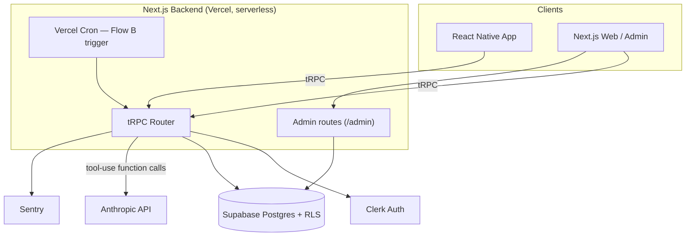
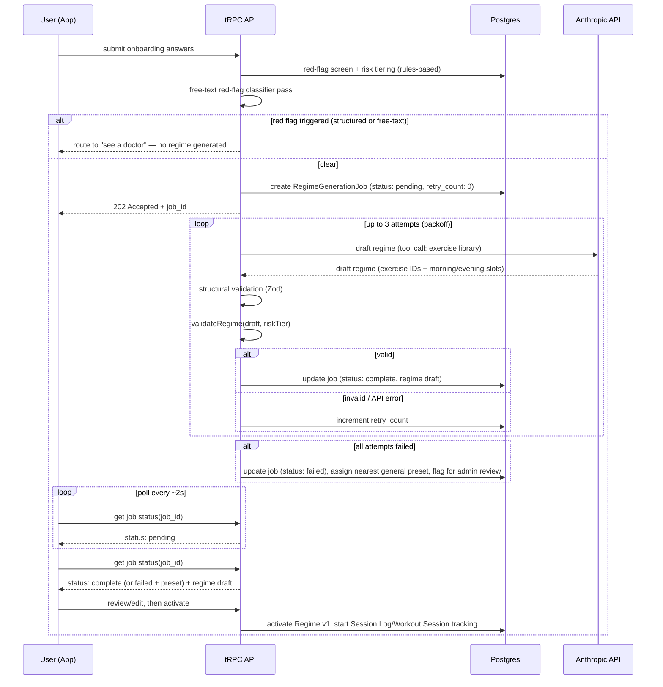
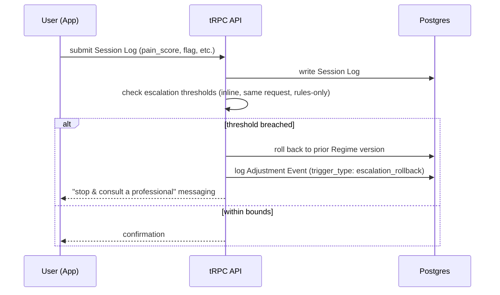

# Rebound.ai PRD

# Overview & Objectives

*What we're building and what success looks like. Include 2-3 measurable objectives.*

AI-powered recovery and performance app built for athletes — observes a user's pain, mobility, and strength on a recurring basis and recursively adjusts their training/recovery regime to keep them moving toward their goal instead of sidelined by it. Success is defined as measurable improvement in a user's self-reported pain and mobility/strength scores on their target movement(s) over time, without a corresponding increase in adverse events (re-injury, pain spikes).

**Objectives**

- **Activation:** ≥60% of new signups complete onboarding (goal selection + finetuned regime) and log at least one session within 7 days.
- **Efficacy:** Among users with ≥4 weeks of consistent logging, ≥50% show a statistically meaningful improvement (e.g., ≥2-point drop on a 0–10 pain scale, or measurable ROM/strength gain) on their target movement.
- **Retention:** ≥35% D30 retention (users still logging at least 2x/week at day 30).

# Problem Statement

*What problem are we solving, and what evidence tells us it's worth solving?*

Athletes lose training time to nagging injuries and under-recovery — not because recovery is impossible, but because it's hard to prioritize without structure, feedback, and accountability, and the existing options are either a slow, clinical PT pipeline (referral, scheduling, insurance) or generic fitness apps with no real recovery logic behind them. Physical therapy and stretching apps in general struggle with the same underlying adherence problem: users forget to do their exercises because life/training is busy, or they disengage because they're unsure if they're doing an exercise correctly and get discouraged by lack of visible progress. The result is athletes staying sidelined longer than they need to, or returning to training under-recovered and at risk of re-injury.

# Intended Audience

*Who is the audience / use case.*

- **Athletes** (amateur through competitive) — the primary audience and go-to-market focus, see Competitive Landscape & Differentiation > Brand Positioning.
- Fitness individuals / general training population
- Patients with Hindering Diseases (Auto-Immune Disease, etc) — still fully supported by the underlying product, just not the lead marketing angle
- Elderly — same as above

Broadening the marketed audience to athletes doesn't narrow who the safety rules protect — the Clinical Risk Framing guardrails below are written for, and still fully cover, everyone on this list.

# Daily Session Structure

*The core Duolingo-style habit loop — this is a deliberate differentiator from competitors (see Competitive Landscape), not an incidental feature.*

Every user gets exactly **two sessions per day**, no more, no fewer — this is fixed, not user-configurable:

- **Morning session** (on wake): bundles the day's stat/pain check-in with the first exercise block. Content leans mobility/activation.
- **Evening session** (at sunset): the second and final exercise block. Content leans strength/recovery depending on what the regime calls for. Anchored to sunset rather than a fixed clock time — this likely shares its geolocation/astronomical-timing mechanism with the prayer-time notification preset in Open Question #3, and should be built once, not twice.

**Content-aware slot assignment.** The LLM assigns each exercise to morning or evening at regime-generation time (Flow A) and re-assigns as needed at each recursive adjustment (Flow B) — using onboarding/session context to judge fit, not a fixed rule. A self-described busy office worker gets denser, more efficient sessions; a self-described younger ex-athlete's sessions can run longer or heavier. The exercise library's existing `category` field (mobility/strength/stretch) is a soft signal for slot fit but the LLM's read of the user's stated context drives the actual split.

**Streak logic.** A calendar day maintains the streak if **at least one of the two sessions** was completed — completing both isn't required, and skipping the evening session after doing the morning one (or vice versa) doesn't break the streak. This is deliberately more forgiving than an all-or-nothing streak, matching real adherence patterns better than punishing a missed single session. What happens to the streak once a user's stated goal is met remains open — see Open Question #2.

# Clinical Risk Framing

### Why this needs its own section

The app is marketed primarily to athletes (see Intended Audience), but its user base spans higher-risk populations too (e.g., autoimmune disease, elderly), and it includes an AI loop that adjusts a user's self-reported pain/mobility program over time. That pattern is commonly scrutinized for potential Software as a Medical Device (SaMD) classification, and it affects liability + insurance posture. Not legal advice — get legal review before launch — but the PRD needs an explicit position.

### Decision — Pure AI automation, chosen for v1

No clinician in the loop for any tier in v1 (this is the differentiation). Weekly loop: evaluate the trailing 1–2 weeks of self-reported trajectory → hold/progress if improving → adjust/rollback if not → repeat until pain-free or user ends. Because there's no clinician safety backstop, the guardrails below are non-optional. Any clinician-reviewed tier is a deliberate future decision.

### Concrete onboarding safety requirements (v1, non-negotiable)

- **Red-flag screen** before any regime (severe/sudden pain, numbness/tingling, trauma, post-surgical, pregnancy-related, cardiac exertion symptoms) → route to "see a doctor/PT."
- **Risk tiering** (age, condition type, pain severity, autoimmune/chronic flag) gates allowed aggressiveness.
- **Escalation + pause** on pain spikes / "made it worse" → rollback + "stop & consult a professional" messaging above a threshold. Runs in real time on every Session Log write, not gated to the weekly adjustment cycle — see Regime Generation Architecture below for the concrete thresholds.
- **Change ceilings**: hard rules-based weekly bounds independent of the LLM. *Given v1 exercise content has no PT-annotated contraindications (see Technical Scope), default to conservative/lower-intensity exercise selection and smaller week-to-week changes until PT-reviewed content exists.*

### Regime Generation Architecture (resolves Open Question #1)

Initial-regime generation is **hybrid** — not a pure LLM prompt, and not a pure rules-based mapping. Rules decide *who is eligible for what intensity*; the LLM decides *which specific exercises, and which session slot, within those bounds*; rules validate the output before a user ever sees it. This split is what makes the Pre-launch validation section below testable — the rules layer can be unit-tested deterministically, and PT review only needs to focus on the LLM's judgment within already-safe bounds.

There are two distinct flows, which should not be conflated in implementation: **initial generation** (onboarding, no logged history yet) and **recursive adjustment** (weekly/biweekly, uses trailing Session Log data). A third component, the **escalation monitor**, runs independently of both on a real-time basis.

**Flow A — Initial regime generation**

1. **Onboarding answers** (goal, target movement, symptoms, lifestyle context) captured.
2. **Red-flag screen** (rules-based, no LLM). Flagged → exit to "see a doctor," no regime generated. Clear → continue.
3. **Risk tiering** (rules-based). Sets the allowed change ceiling for this user (see table below).
4. **LLM drafts regime.** Selects exercises **by ID from the exercise library via a tool/function call**, not free-generated text, and assigns each exercise to the morning or evening slot (see Daily Session Structure) based on the user's stated context.
5. **Rules-based validator.** `validateRegime(draft, riskTier)` — no `previousRegime`, so only absolute-bounds checking runs (no delta check exists yet). Out of bounds → clip/regenerate or fall back to a conservative default. Within bounds → continue.
6. **User reviews/edits** before activating.
7. **Regime v1 activated** — Session Log and Workout Session tracking begins from this point.

**Flow B — Recursive adjustment (weekly/biweekly)**

1. **Trailing 1–2 week Session Logs** pulled (pain, mobility/strength indicator, flags) — per the existing non-negotiable to avoid conflating older signal with current trajectory. Window anchor is the later of the regularly scheduled date or the most recent escalation rollback (see Post-rollback cadence below), so this never spans an incident.
2. **LLM proposes adjustment** (hold, progress, or rollback, including any re-slotting between morning/evening), using the current regime and exercise library as tools.
3. **Rules-based validator** — `validateRegime(draft, riskTier, previousRegime)`. With `previousRegime` present, both absolute bounds and the week-over-week delta check run. Too aggressive → clip to ceiling or hold at current regime. Within bounds → continue.
4. **New regime version created; Adjustment Event logged** with `trigger_type: scheduled_adjustment` (rationale, trailing window used). Repeats next cycle.

**Escalation monitor (real-time, decoupled from Flow B's cadence)**

Runs on every Session Log write, not just at the weekly checkpoint — a pain spike shouldn't wait a week to be caught. Thresholds by risk tier:

| Signal | General tier | Light injury tier | Heavier/chronic/elderly tier |
| --- | --- | --- | --- |
| Single log, pain red (7–10) | Immediate pause + rollback | Immediate pause + rollback | Immediate pause + rollback |
| "Made it worse" flag = true | Immediate pause + rollback | Immediate pause + rollback | Immediate pause + rollback |
| Day-over-day pain jump ≥2 pts | Flag for review; rollback if it repeats 2 days running | Flag for review; rollback if it repeats 2 days running | Rollback on first occurrence |
| Yellow (4–6) not settled to green by next morning | Hold; rollback after 2 consecutive occurrences | Hold; rollback after 2 consecutive occurrences | Rollback on first occurrence |

A triggered rollback creates an Adjustment Event with `trigger_type: escalation_rollback`, reverting to the prior regime version and surfacing "stop & consult a professional" messaging. Because this bypasses the scheduled loop, it must still be logged as an Adjustment Event or the reversal-rate guardrail metric will silently undercount the rollbacks that matter most.

**Post-rollback cadence.** Flow B's baseline stays a 7-day trailing window for everyone — shortening it universally would undercut the 10%/5% change-ceiling figures above, which are sourced from weekly-cadence load-management research, and would mix pre-incident and post-incident data into one trend read. Instead, cadence only changes locally around an actual incident:

- **Trailing-window reset.** When an escalation rollback fires, the next scheduled Flow B adjustment's 7-day trailing window is anchored to the rollback date, not the original schedule — so it never straddles the incident and mixes pre/post data.
- **Day-4 post-rollback check.** At day 4 after a rollback (not on a routine cadence, and not for users who haven't had an incident), the system runs a lightweight, rules-based read of the Session Logs already being collected — no new logging burden on the user. It asks one question: has pain stayed at or below the rolled-back level, yes/no? Yes → resume the normal 7-day cycle from this point, no LLM call needed. No → the same escalation-monitor thresholds apply as always. This gives closer attention specifically where something already went wrong, without applying shortened cadence — and its cost and noise tradeoffs — to the large majority of users who never trigger a rollback.

**Tool access, not MCP.** Exercise-library and current-regime lookups are implemented as **plain tool-use function calling** against the Anthropic API, not a standalone MCP server. MCP earns its complexity when multiple external clients/tools need to interoperate; for a single first-party app calling its own database from its own backend, function calling is materially less infrastructure to stand up and maintain for v1.

**Validator scope.** One shared rules module, one function: `validateRegime(draftRegime, riskTier, previousRegime?)`. Absolute bounds (per-tier max intensity/volume) always run. The week-over-week delta check only runs when `previousRegime` is supplied — true for Flow B, naturally absent for Flow A. No separate validator modules needed.

**Change ceilings (v1 defaults).** These are evidence-informed starting points drawn from sports-rehab load-management conventions (the "10% rule" for weekly training-load progression, and the 0–10 pain "traffic light" system used across PT clinics for hold/progress/regress decisions) — **not clinical prescriptions**. Per Pre-launch validation below, a PT/clinical advisor must review and sign off on these numbers before launch.

| Risk tier | Max week-over-week increase | Progress condition | Hold condition | Rollback trigger |
| --- | --- | --- | --- | --- |
| **General / no injury** (fitness, mobility goals) | 10% | Pain stays green (0–3) across trailing window | Pain yellow (4–6) any session | Pain red (7–10), or "made it worse" flag |
| **Light injury** (mild strain/sprain, no chronic/autoimmune flag) | 5% | Green pain AND settles within 24h, 2 consecutive logs | Yellow pain, or green but not settling by next morning | Red pain, or 2-point+ jump from prior week's baseline, or "made it worse" flag |
| **Heavier injury / chronic / autoimmune / elderly** | Hold-only by default; progress only after 2 consecutive green cycles | Same as above, doubled confirmation window | Yellow pain, or any single non-green log | Red pain, "made it worse" flag, or any yellow after a prior hold (two strikes → rollback, not another hold) |

Notes on the table:
- The general tier uses the standard 10% figure since risk tiering already routes higher-risk users out of this bucket.
- The light-injury tier sits below general population norms (5% vs. 10%) by design — injured tissue gets a smaller ceiling than a general-fitness user by default, independent of what the LLM judges it could handle.
- The heaviest tier defaults to *hold*, not slow progress, since this is the group with the least clinical backstop and the most downside from a wrong call.
- The 24-hour settle check is computable directly from Session Log: compare a user's `pain_score` at day N vs. day N+1.

### LLM Reliability & Failure Handling (resolves Additional Open Items — LLM Reliability & Failure Handling)

Every Flow A/B step that touches the LLM has a defined failure path — none of them ever result in an unhandled error reaching the user or an unsafe regime slipping through.

**Two separate validation layers, run in order.** These stay as distinct functions rather than one combined check, because they answer different questions and fail differently:

1. **Structural validation** (new, runs first) — a Zod schema check on the LLM's drafted regime object: required fields present, `exercise_list` non-empty, sets/reps/duration within sane numeric ranges, no duplicate exercise entries, valid `session_slot` enum values. This catches malformed output before it's even a candidate for clinical review.
2. **Clinical validation** (existing) — `validateRegime(draft, riskTier, previousRegime?)`, unchanged from above. Only runs on output that already passed structural validation.

**Invalid or nonexistent exercise ID.** Handled inside the tool-use loop itself, not as a downstream error: the exercise-library tool validates the requested ID against the database before returning a result. An invalid ID returns an error `tool_result` ("exercise_id not found") in the same turn, and the model is expected to self-correct. Capped at 2 correction attempts within the tool-use loop before falling through to the outer retry policy below — this prevents a single bad ID from spiraling into an unbounded loop.

**Anthropic API down or rate-limited.** Handled differently per flow, using infrastructure the system already has:

- **Flow A (onboarding).** `RegimeGenerationJob.status` gains a `failed` state with a `retry_count`. The job handler retries 2–3 times with exponential backoff. If all retries exhaust, the user is **not** blocked — they're handed the closest-matching general preset for their risk tier (already in v1 scope) so onboarding still completes same-day, and the job is flagged for admin review. This keeps the async-job architecture doing double duty as the failure-handling mechanism, rather than adding a second system.
- **Flow B (scheduled adjustment).** If the API is unreachable during a cron run, the safe default is to **hold** — skip the adjustment for that user this cycle. Hold is already a clinically valid state in the change-ceiling table above, so this introduces no new concept. Logged as an Adjustment Event (`trigger_type: scheduled_adjustment`, rationale noting the system-level cause) so it's distinguishable later from an LLM-chosen hold. Retried automatically next cron cycle.
- **Escalation monitor.** Rules-based only; never calls the LLM. Worth stating explicitly here since it means the app's real-time safety backstop is structurally unaffected by Anthropic API outages, unlike Flow A/B.

**`validateRegime` fails repeatedly.** One retry, with the specific rejection reason fed back to the LLM as context (e.g., "proposed week-over-week volume increase of 22% exceeds this user's 10% ceiling — revise"). If the second attempt also fails:
- Flow A → fall back to the nearest general preset for that risk tier, flagged for admin review (same destination as the API-outage case above).
- Flow B → fall back to hold (same destination as the API-outage case above).

Using the same two fallback destinations regardless of *why* generation failed (outage vs. malformed output vs. repeated validator rejection) keeps this to one failure-handling story instead of three, and keeps the admin panel's "flagged for review" queue meaningful — anything landing there is genuinely worth a human look, not a routine retry artifact.

### Free-Text Input Handling (resolves Additional Open Items — Input Handling)

Onboarding's free-text fields (symptoms, lifestyle context) need handling beyond "pass the string into the prompt," for three separate reasons:

- **Length bounding.** Cap each free-text field at ~500–750 characters. Controls token cost on every Flow A call and shrinks the surface for prompt injection.
- **Prompt hygiene.** Free text is passed into the regime-generation prompt as clearly delimited user-content (e.g., dedicated XML tags), never concatenated into system-level instructions. Standard practice, but worth stating explicitly here since this prompt drives a safety-relevant output — the goal is that even an adversarial free-text input can only ever influence which exercises get proposed, never bypass `validateRegime`'s bounds.
- **Red-flag leakage check.** This is the real gap, not just hardening: the structured red-flag screen is explicitly the *only* gate before a regime is generated (see Concrete onboarding safety requirements above), but nothing currently stops a user from answering "no" on a structured question and then disclosing the same red flag in free text instead — e.g., "36 weeks pregnant, sciatica's been brutal" typed into the lifestyle-context box. That content would flow straight into Flow A's draft step with no safety check on it. **Resolution:** add a lightweight secondary pass over free-text fields — a rules-based keyword scan or a cheap classifier call (Haiku-tier model; this is classification, not generation) — run specifically to catch red-flag disclosures the structured screen missed, before Flow A's LLM-draft step. A hit routes the same way a structured red flag does: exit to "see a doctor," no regime generated.
- **Consistency across call sites.** Open confirmation needed: is onboarding free text re-fed into Flow B prompts on every adjustment cycle, or captured once and never touched again? If it's reused, the length-bounding and red-flag-scan logic above must run at every call site that reads it, not just at intake — otherwise a gap opens up months after onboarding rather than at signup. Flagging this as a decision to pin down during implementation rather than resolving it here, since it depends on how much of the original free text Flow B's prompt actually needs.

### Pre-launch validation

Create a held-out test set of realistic trajectories (plateauing, worsening, contradictory) and have a PT/clinical advisor review proposed adjustments pre-launch. Track "reversal rate" from day one.

### Legal/ops items to open now

Open now: TOS + medical disclaimers (digital-health counsel), liability insurance scoping, state health-data law applicability (e.g., CMIA) even if not HIPAA, and App Store / Play health-data requirements.

# Technical Scope

*What's in v1 and what's intentionally deferred. The Out of Scope list should anticipate questions stakeholders will actually ask.
In Scope*

- Onboarding & goal capture: User signs up and selects their reason for using the app (injury recovery, strength, mobility, etc.); the initial regime is generated via the hybrid Flow A described in Clinical Risk Framing > Regime Generation Architecture (red-flag screen → risk tiering → LLM draft grounded in the exercise library via tool use, with morning/evening slot assignment → structural validation → rules-based change-ceiling validation → user review). v1 treats a user as having a single primary `target_movement` — see Data Model note below.
- Regime finetuning & activation: User can adjust the AI-generated regime before activating it; once active, the app begins tracking from that point
- Stat logging: User logs pain/mobility/strength stats **once daily**, bundled with the morning session — see Daily Session Structure. (Supersedes the earlier "daily or every other day" placeholder.)
- Streak/accountability system: Duolingo-style streak mechanic — a day counts toward the streak if **at least one of the day's two sessions** (morning or evening) is completed; see Daily Session Structure for full logic. What happens to the streak once a user's stated goal is met remains open — see Open Question #2.
- Notification system: Two notifications per day, fixed — a morning (wake) notification bundling stat log + session 1, and an evening notification anchored to sunset for session 2. Exact wake-time logic, sunset/geolocation implementation, and any additional preset options (including prayer-time-based scheduling) are still open — see Open Question #3.
- Recursive adjustment agent: A mini-LLM/agent reviews the user's pain/movement stats and trajectory on a recurring (weekly or biweekly) basis and adjusts the regime accordingly, using only the trailing 1–2 weeks of data to avoid conflating older signal with current trajectory. Implemented as Flow B in Clinical Risk Framing > Regime Generation Architecture. A separate real-time escalation monitor (not gated to this weekly cadence) watches every Session Log write for pain spikes or "made it worse" flags and can trigger an immediate pause-and-rollback independent of the scheduled loop. Both paths validate any regime change through the same shared `validateRegime` function before it's applied, with structural validation and failure/retry handling per Clinical Risk Framing > LLM Reliability & Failure Handling.
- General presets: Preset regimes for common use cases (pre-gym, morning & night, pre-run, etc.), independent of a user's personalized recovery regime. Also serve as the fallback destination when Flow A fails to produce a valid regime — see LLM Reliability & Failure Handling.
- Accessibility baseline: given elderly users are an explicit target audience, v1 should include font scaling and larger tap targets at minimum — scope depth is Open Question #5.
- Exercise data & demo visuals: v1 exercise data is sourced from Free Exercise DB (public domain, text only — names, instructions, muscle groups, equipment, category). For the pre-funding investor demo specifically, exercise GIFs are pulled from AscendAPI's free hosted tier (oss.exercisedb.dev) — free, no signup, 1,500 exercises with 180p GIFs, explicitly the vendor's own evaluation tier. Treated as fully disposable for demo purposes only — record/pre-cache demo content rather than relying on a live call during an actual investor pitch, to avoid uptime risk at the moment it would cost something.

Deferred to a later version (not v1, but expected)

- Camera-based form tracking/correction — see Out of Scope below for why this isn't v1
- Licensed PT-authored/annotated exercise content — v1 exercise library (Free Exercise DB) carries no clinical annotation (contraindications, rehab-specific progressions, isometric/regression staging). A licensed PT reviewing and annotating the library — or authoring rehab-specific content general libraries don't cover (nerve glides, balance/vestibular work, graded ROM regressions) — is deferred alongside the camera feature and PT-document upload below. Implication for v1: since exercise selection itself carries no clinical safety annotation, the Clinical Risk Framing guardrails (red-flag screening, change ceilings, risk tiering) are the only safety layer — v1 exercise selection logic should default conservative (lower intensity, smaller week-to-week changes) until PT-annotated content exists.
- Funded upgrade — licensed exercise media: once funded, swap from the free demo GIF source to AscendAPI Shop (shop.ascendapi.com) — one-time purchase, own outright, no subscription. Standard tier ($500, up to 720p images/GIFs, future updates included) or Premium ($600, up to 1080p) — Starter ($300) excluded due to no future-updates access. Chosen specifically because it's the same vendor/ecosystem as the free demo tier, making the swap close to seamless (same schema/catalog family) rather than a full re-integration with a different vendor. Note: confirm exact schema match between the free demo API and the paid Shop dataset before the actual swap — same company, but technically separate products. (RepDB and ExRx.net were evaluated as alternatives but not chosen, for reference.)
- PT/clinical document upload — Let users with existing PT documentation upload it so the AI can use it instead of (or alongside) the onboarding questionnaire. Casual/fitness/elderly users would still go through the standard questionnaire path.
    - This isn't just a bigger version of the questionnaire — it moves the product from "AI interprets self-reported symptoms" to "AI interprets and acts on real clinical documentation," closer to clinical decision support, with meaningfully higher liability and parsing-accuracy risk. If built, v1 of this feature should make the AI's read of the document advisory (surfaced for user confirmation), not autonomous. MVP ships with the questionnaire path only.
- True multi-goal support (multiple concurrent `target_movement`s with independent tracking) — see Data Model note below. The schema allows for it; the v1 product does not implement it.

Out of Scope

- Camera-based form tracking/correction
- Diagnosing injuries or replacing medical/PT consultation
- Integration with wearables, EHR/EMR, or insurance/billing systems
- Social/community features (leaderboards, sharing)

# Designs

TBD — flag to team: needs to happen before engineering can produce a real timeline estimate, not just before build starts.

*[link to Figma]*

**Groundwork, not a substitute:** `page-map.md` (repo root, drafted 2026-08-18) is a researched page/screen
inventory — 32 candidate screens across Marketing, Onboarding, Core Loop, Engagement, and Account/Settings/Commerce,
benchmarked against Strong, Hevy, Whoop, MyFitnessPal, Peloton, Freeletics, Sword Health, Hinge Health, and
Duolingo's structure, cross-referenced against what's actually built today. Useful as a starting menu for whoever
does the real Figma pass, not a replacement for it.

# Data Model (Draft)

This is a starting schema, not final — "regime," "session," and "exercise" need concrete shapes before engineering can build against this PRD.

### User

- id, created_at
- goal_type (enum: injury_recovery, strength, mobility, general_fitness)
- risk_tier (from onboarding screening)
- condition_flags (array — autoimmune, post-surgical, chronic, etc.)
- target_movement(s) — **schema stores an array for forward compatibility, but v1 enforces a single primary movement at the UI/API layer** (see Smaller Gaps resolution below). True multi-movement tracking is deferred — see Technical Scope.

### Exercise (library item)

- id, name
- category (mobility/strength/stretch)
- target_muscle_group(s)
- difficulty_level
- contraindications (array)
- progression_group (links easier/harder variants of the same movement)
- media (instructional image/video refs)
- source (who authored/vetted it)

### Regime (versioned — the object the agent modifies over time)

- id, user_id, version_number, created_at
- created_by (agent vs. user-edited)
- exercise_list (array of exercise_id, sets, reps/duration, frequency, **session_slot** — enum: morning, evening)
- status (active, superseded, ended)
- end_reason (nullable enum — e.g. "goal met," "user ended")
- parent_regime_id (links each version to the one it replaced, supporting history/rollback)

### Workout Session (one per scheduled morning or evening slot, per day)

- id, user_id, regime_version_id, date
- slot (enum: morning, evening)
- scheduled_at, completed_at (nullable)
- exercises_completed (array of exercise_id, or bool per exercise)

*This is distinct from Session Log below — Workout Session tracks exercise completion (what streaks are computed from); Session Log tracks self-reported stats. They're linked (the morning Workout Session is the one bundled with the daily Session Log) but are separate objects so streak logic and pain/mobility trend logic don't have to share one row shape.*

### Session Log (one per day — the daily stat/pain check-in, bundled with the morning session)

- id, user_id, regime_version_id, logged_at
- pain_score (0–10)
- mobility/strength_indicator (flexible/typed field per goal_type)
- completed (bool)
- perceived_exertion (optional)
- flag ("this made it worse" — feeds the adverse-event guardrail metric and the escalation monitor)

### Adjustment Event (audit trail for the agent)

- id, user_id, from_regime_version_id, to_regime_version_id, triggered_at
- trigger_type (enum: scheduled_adjustment, escalation_rollback — the latter covers real-time escalation-monitor rollbacks, which bypass the weekly Flow B cadence but must still be logged here or the reversal-rate metric undercounts)
- trailing_window_used (confirms only 1–2 weeks of data used)
- rationale (agent's stated reason, stored even if not user-facing — also carries system-level causes per LLM Reliability & Failure Handling, e.g. "held due to API outage" or "held after 2 failed validateRegime attempts")
- was_reversed (bool, set retroactively — this is the reversal-rate guardrail metric as a first-class field)

*Note: Success Metrics require measuring "meaningful improvement" against baseline and tracking a reversal rate — neither is measurable without Session Log, Workout Session, and Adjustment Event existing as structured, queryable objects from day one. Retrofitting this after launch means losing baseline data for early cohorts.*

# Open Questions & Risks

*Unresolved decisions and known risks. Pair each with a mitigation, owner, or next step.*

1. **Initial-regime generation logic — resolved.** Hybrid: rules-based red-flag screening and risk tiering gate the LLM, the LLM drafts using tool-use function calling grounded in the exercise library (not MCP) and assigns morning/evening slots, and structural validation plus a rules-based change-ceiling validator check the output before the user sees it. The same architecture, plus a real-time escalation monitor, drives the recursive adjustment loop. See Clinical Risk Framing > Regime Generation Architecture for the full flow, escalation thresholds, and the v1 change-ceiling table.
2. **Streak design — partially resolved.** What it rewards is settled: completing at least one of the day's two sessions (morning or evening) maintains the streak; see Daily Session Structure. Still open: what happens to the streak once a user's stated goal is met — does it end, convert to a maintenance streak, or something else?
3. **Notification scheduling** — fixed at two notifications/day (morning wake, evening sunset-anchored per Daily Session Structure). Still open: the exact wake-time detection logic, the sunset/geolocation implementation (likely shared with the prayer-time preset below), and which additional preset options ship at v1, including whether prayer-time-based scheduling is in v1 or deferred.
4. **Exercise library sourcing — resolved, both phases** — (a) *Data*: Free Exercise DB (public domain) for v1 logic. (b) *Demo visuals*: AscendAPI free tier (oss.exercisedb.dev), disposable, demo-only. (c) *Funded launch*: AscendAPI Shop, Standard or Premium tier ($500–$600 one-time), chosen for same-ecosystem continuity with the demo tier. See Technical Scope.
5. **Elder accessibility** — is font scaling, larger tap targets, and plain-language copy in v1 scope, given elderly users are an explicit target audience, or a fast-follow?
6. **Escalation thresholds — resolved.** Concrete per-tier trigger table (single red log, "made it worse" flag, day-over-day pain jump, non-settling yellow) defined in Clinical Risk Framing > Regime Generation Architecture, running in real time on every Session Log write rather than gated to the weekly adjustment cycle.
7. **Validator scope — resolved.** One shared function, `validateRegime(draftRegime, riskTier, previousRegime?)` — absolute bounds always checked, delta check only when `previousRegime` is supplied. Runs after a separate structural (Zod) validation pass. See Clinical Risk Framing > Regime Generation Architecture and LLM Reliability & Failure Handling.
8. **LLM reliability & failure handling — resolved.** Structural validation runs before clinical validation; invalid exercise IDs are corrected within the tool-use loop (capped at 2 attempts); API outages default to a preset fallback (Flow A) or hold (Flow B); repeated `validateRegime` failures get one LLM retry with the rejection reason, then the same fallback destinations. See Clinical Risk Framing > LLM Reliability & Failure Handling.
9. **Free-text input handling — resolved.** Length-bounded, passed to prompts as delimited user-content, and scanned by a secondary red-flag classifier before Flow A drafts a regime — closing the gap where a user could disclose a red flag in free text after clearing the structured screen. Still open: whether this free text is re-fed into Flow B prompts, which determines whether the same handling needs to run at every adjustment cycle or only at intake. See Clinical Risk Framing > Free-Text Input Handling.
10. **`target_movement` cardinality — resolved for v1.** Schema keeps the array for forward compatibility; product enforces single-selection. True multi-goal tracking (independent pain trajectories per movement) is deferred — see Technical Scope and Data Model.
11. **Claude model version — resolved (initial pick, pending unit-economics confirmation).** Sonnet 5 for both Flow A and Flow B calls. See Tech Stack for pricing and rationale, and the Unit Economics item below for the remaining confirmation step.

*(Resolved, kept for record: "Could this lead to greater injury?" is now addressed by Clinical Risk Framing's guardrails. "What if the user's injury goes away?" is handled by the Regime's `end_reason` field in the Data Model.)*

# Success Metrics

*How will we know this worked? One primary metric, plus a guardrail for what shouldn't get worse.*

**Primary metric:** % of active users (≥4 weeks logging) who show a measurable, sustained improvement in their target metric (pain score, ROM, or strength benchmark — whichever applies to their stated goal), measured against their own baseline at regime start.

**Guardrail metrics** (things that must *not* get worse as we optimize the primary metric):

- Adverse event rate (self-reported pain increase of ≥2 points, or user-flagged "this made it worse")
- Churn/drop-off rate — are we losing users because the regime is too aggressive or notifications too frequent? Includes both involuntary churn (failed payment) and voluntary cancellation, captured with a reason code — see Business Model.
- Regime-adjustment "reversal rate" — how often does the AI need to walk back a change it made the prior cycle (a proxy for adjustment quality), tracked across both `scheduled_adjustment` and `escalation_rollback` trigger types

# Competitive Landscape & Differentiation

**Closest competitors:** Sword Health and Hinge Health (Sword acquired Kaia Health in Jan 2026). Common pattern: AI/app + licensed PT in the loop (often hardware-assisted), distributed mostly B2B2C via employers/insurers. Smaller players (Omada MSK, Vori, RecoveryOne, telehealth-PT platforms) follow similar models.

**Why a user picks Rebound.ai instead:**

- **Direct access:** start without employer coverage, insurance auth, or diagnosis.
- **DTC cost:** pricing stays low because there's no clinician-hour overhead (trial through first regime cycle → subscription).
- **Speed:** no scheduling and no hardware — questionnaire → regime immediately; more consumer-app habit loop.
- **Broader scope:** not just diagnosed MSK injuries; also in-season training load, mobility work, and recovery between hard sessions — a training tool, not just a rehab tool.
- **Habit-loop structure:** a fixed, forgiving two-session daily rhythm (wake + sunset) with content-aware exercise placement and a streak that only needs one of the two sessions — see Daily Session Structure. This is a deliberate product bet, not incidental: it's the mechanism meant to solve the adherence problem named in Problem Statement, not just a gamification layer bolted on top.

**Trust mechanisms forgone at v1 (deliberate):**

- **Licensed PT review:** omitted to preserve pure automation + DTC cost structure; makes Clinical Risk Framing guardrails non-negotiable.
- **Published outcomes:** not at v1; positioning is access/speed/cost until cohort data exists.

**Positioning line:** "Train like an athlete, recover like one too — an AI-adjusted plan that keeps you moving toward your next PR instead of sidelined by pain, no doctor's referral or insurance approval needed."

**Brand Positioning (marketing layer, not a product/architecture change).** Rebound.ai markets to athletes the way lifestyle-fitness brands (e.g., Celsius) market performance/energy products to a broad, non-clinical fitness audience — energetic, performance-and-recovery framing rather than clinical "physical therapy" framing. This is a go-to-market and copy decision, not a change to the underlying product: the Clinical Risk Framing guardrails (red-flag screening, risk tiering, change ceilings, escalation monitor) are unchanged and still fully apply to every user, including the higher-risk populations named in Intended Audience. Athletes get injured too — the same guardrails that stop an elderly user's regime from progressing too fast are exactly what should stop an athlete from re-aggravating a strain by pushing back into training too soon.

# Business Model

**Model:** Subscription, not one-time purchase. The core value (an ongoing, adapting regime) and the core cost (LLM inference on every adjustment cycle) are both recurring — a one-time payment would mean absorbing inference costs indefinitely after a single purchase.

**Trial mechanics:** Free access through onboarding, the questionnaire, the AI-generated first regime, and all supporting features (streaks, notifications, presets). The paywall triggers at the first recursive regime adjustment (typically ~1 week in) — the user experiences the full product once before being asked to pay to continue.

**Pricing:** TBD. Reference points from comparable players: flat low-monthly, insurance-independent tiers around $14.99/mo exist in this market; outcome-based pricing (charging more as measurable improvement occurs) is also precedented but adds complexity Rebound.ai likely doesn't want at v1 given the pure-AI, no-clinician-review cost structure.

**Voluntary cancellation (resolves Smaller Gaps item).** Minimal v1 version, deliberately decoupled from the still-open free-tier question below: cancellation takes effect at the end of the current billing period (standard Stripe behavior, less punitive than immediate cutoff), and capture a reason code at cancel time (feeds the churn guardrail metric in Success Metrics). On cancellation, personalized-regime access downgrades to presets-only. That last behavior will need revisiting once the free-tier question below is resolved, since it directly determines what a canceled user retains.

**Open item:** exact price point and whether any free tier persists post-trial (e.g., presets/general fitness features remain free, personalized recovery regime is the paid feature). This also gates the fuller win-back flow (offers, re-engagement) beyond the minimal cancellation handling above.

# Analytics & Instrumentation

The Data Model defines the objects; this defines how they get measured against the metrics in Success Metrics.

- **Activation (≥60% in 7 days):** track onboarding-step completion events (goal selection → regime generated → regime activated → first Session Log / Workout Session created) as a funnel, timestamped against signup.
- **Efficacy (≥50% meaningful improvement at 4 weeks):** computed from Session Log `pain_score` / indicator deltas against the first logged baseline per user, for users with ≥4 weeks of Session Logs.
- **Retention (≥35% D30):** computed from Session Log frequency per user (≥2x/week) at the day-30 mark.
- **Guardrails (adverse event rate, churn, reversal rate):** adverse events and churn pull from Session Log `flag` and account-status events (including the voluntary-cancellation reason code — see Business Model); reversal rate pulls directly from Adjustment Event's `was_reversed` field, segmented by `trigger_type`.

**Open item:** tooling choice (e.g., product analytics platform vs. internal dashboard queries against Postgres directly) — not decided yet, but the event/field-level tracking above should hold regardless of tooling.

# Tech-Stack

*Most of this is TBD, but just getting a general idea.*

**Frontend (Mobile):** React Native

- Single codebase for iOS + Android; large ecosystem for push notifications and (eventually) camera/ML libraries when the camera-based form-tracking feature gets built. Calls the same backend as the web app below.

**Frontend (Web/Admin):** Next.js

- Handles the marketing site and any web/admin surface. Also hosts the shared backend (see below), so the web team and the API are one deploy, one language, one repo.

**APIs & Backend Logic:** Next.js API routes (App Router route handlers)

- One shared backend serving both React Native and the Next.js web frontend — same TypeScript codebase end to end, no separate service to run or deploy. Replaces the earlier Python/FastAPI plan.
- The regime-generation and adjustment agents (see Clinical Risk Framing > Regime Generation Architecture) call the Anthropic API directly with plain tool-use function calling for exercise-library and current-regime lookups — no MCP server. Rules-based screening, tiering, structural (Zod) validation, and the shared `validateRegime` change-ceiling validator run as deterministic TypeScript in this same backend, independent of the LLM call. The real-time escalation monitor runs as a check on the Session Log write path, not as part of the weekly adjustment job.
- **Caveat:** the future camera-based form-tracking feature (deferred, not v1) leans on pose-estimation libraries that are overwhelmingly Python. When that gets built, the likely path is a small standalone Python microservice just for that feature, called from the Next.js backend — not a reason to build the whole backend in Python now.

**LLM model choice (resolves Smaller Gaps item):** **Claude Sonnet 5** for both Flow A and Flow B calls, as the v1 default. As of today, Sonnet 5 runs introductory API pricing of $2/$10 per MTok (input/output) through August 31, 2026, moving to standard $3/$15 after; Haiku 4.5 is $1/$5; Opus 5 is $5/$25. Sonnet 5 is the reasonable default over Haiku because regime drafting and adjustment reasoning (slot assignment, hold/progress/rollback judgment) benefit from a stronger model than a pure classification task needs, and over Opus because this is a well-scoped, tool-use task with rules-based guardrails on both sides of the call, where Opus-level reasoning is unlikely to be load-bearing. The secondary red-flag classifier on free text (see Free-Text Input Handling) is a good candidate for Haiku instead, since that step really is classification. This pick is provisional on the Unit Economics open item below — actual token volume per Flow B cycle plus escalation-monitor-is-LLM-free math needs to clear the ~$14.99/mo reference price point before it's locked in.

**Auth & Permissions:** Clerk

- Handles sign-up/sign-in/session management for both React Native and Next.js. Clerk integrates with Supabase as a third-party auth provider, so Postgres Row Level Security can still be enforced using Clerk's JWT claims — "User A can never query User B's pain/injury data" stays a database-layer guarantee, not just app-logic, same as the original Supabase Auth plan.

**Payments & Billing:** Stripe

- Handles the subscription billing described in Business Model (free trial through first regime cycle, paywall at first adjustment, voluntary cancellation at period end with a captured reason code). Stripe's subscription APIs and webhooks are the standard fit here — trial periods, plan changes, cancellation, and dunning/failed-payment handling come mostly built-in rather than hand-rolled.

**Database:** Supabase (Postgres)

- Kept independent of the Auth change — Clerk handles identity, Supabase Postgres remains the data layer with RLS enforced via Clerk JWTs (see Auth above).

**Hosting & Deployment:** Vercel

- Now hosts everything — the Next.js web frontend and the Next.js API backend deploy together as one app. Render/Fly.io are no longer needed since there's no separate Python service to host. Git-push deploys, no server management, matches a small team's bandwidth pre-PMF.

**Cloud & Compute:** Vercel serverless/edge functions for the backend; offload LLM inference to the Anthropic/OpenAI API rather than self-hosting models

- Same reasoning as before — don't manage GPU infra for v1, let the model provider handle that. Compute footprint is now entirely within Vercel's managed runtime rather than split across two hosts.

**CI/CD & Version Control:** GitHub + GitHub Actions

- Standard, well-documented, integrates cleanly with Vercel's deploy hooks.
- **Branching model** (set up 2026-08-18, see `HANDOFF.md` for full operational detail): `feature/<name>` branches off `dev` → PR into `dev` (integration) → PR `dev` into `stage` (pre-prod) → PR `stage` into `main` (production). `main` and `stage` require PRs, no direct pushes; `dev`/`feature/*` stay open. No GitHub Actions workflows exist yet — CI (typecheck/tests on PRs into these branches) is still a TODO, not wired up.

**Security & RLS:** Postgres Row Level Security (via Supabase, enforced using Clerk JWT claims) + standard OWASP practices + a secrets manager (Doppler or Vercel's built-in environment variable store)

- RLS remains the technical mechanism enforcing per-user data isolation for pain/injury data — the Clerk + Supabase RLS integration preserves this even though Auth moved off Supabase's native auth.

**Rate Limiting:** Upstash Redis + a rate-limiting middleware in the Next.js API layer, or Vercel's/Cloudflare's built-in rate limiting

- Protects both API abuse and LLM API spend, same reasoning as before — this doesn't change with the backend swap.

**Caching & CDN:** Vercel's built-in edge network/CDN + Upstash Redis (app-level caching for preset regimes and static exercise-library content)

- Now largely covered by Vercel natively since frontend and backend are unified there; Cloudflare becomes optional rather than required.

**Load Balancing & Scaling:** Handled by Vercel's auto-scaling for v1

- Not a v1-critical concern at expected early user volumes; simpler now with a single hosting provider instead of two.

**Error Tracking & Logs:** Sentry (covers both the Next.js app and React Native mobile crash reporting) + Vercel's built-in log aggregation

- Sentry supports both React Native and Next.js natively, so this stays a single tool across the whole stack despite the backend swap.

**Availability & Recovery:** Managed Postgres backups with point-in-time recovery (via Supabase) + a written incident/failover runbook

- Unchanged — losing weeks of a user's pain/mobility history is a real trust failure for a health-tracking app; automated backups aren't optional here.

# Additional Open Items — To Address

## LLM Reliability & Failure Handling — resolved

See Clinical Risk Framing > LLM Reliability & Failure Handling for the full resolution: structural (Zod) validation before clinical validation, tool-loop self-correction for invalid exercise IDs (capped at 2 attempts), API-outage fallbacks (preset for Flow A, hold for Flow B), and a one-retry-then-fallback policy for repeated `validateRegime` failures.

## Input Handling — resolved

See Clinical Risk Framing > Free-Text Input Handling for the full resolution: length bounding, delimited prompt placement, and a secondary red-flag classifier pass closing the gap where a structured-screen "no" could be contradicted by a free-text disclosure. Open sub-item carried forward: confirm whether free text is reused in Flow B prompts, which determines where else this handling needs to run.

## Unit Economics

- [ ]  Model LLM inference cost per active user per week (Flow B cadence + real-time escalation monitor on every Session Log write, now with a Sonnet 5 baseline per Tech Stack) against the ~$14.99/mo price point, to confirm the "no clinician overhead" pricing thesis actually holds margin.

## Risk Tiering

- [ ]  Define a path for risk-tier re-assessment after onboarding (e.g., autoimmune flare, new mid-program injury) — currently risk tier is set once and never revisited, but it's the only lever controlling change ceilings.

## Red-Flag Screen

- [ ]  Explicitly document in Clinical Risk Framing that the red-flag screen only catches conditions disclosed at onboarding — it cannot catch symptoms emerging later or underreported by the user. Likely to come up with legal/insurance review. (Note: the free-text red-flag classifier narrows, but does not eliminate, this gap — it only covers what's disclosed at onboarding, structured or not.)

## Missing PRD Sections

- [ ]  Roadmap/timeline — milestones, target launch date, and sequencing (e.g., when PT review happens relative to fundraising vs. launch).
- [ ]  Ownership — assign owners to each open item/question (template calls for this, currently unassigned).
- [ ]  Non-clinical risks — vendor dependency risk (AscendAPI free tier for demo), and concentration risk from a single-vendor stack (Vercel/Supabase/Clerk).

## Smaller Gaps — resolved

- [x]  Multiple `target_movement(s)` — resolved for v1: schema keeps the array for forward compatibility, product enforces single-selection at the UI/API layer. True multi-goal tracking deferred — see Technical Scope and Data Model.
- [x]  Voluntary cancellation/win-back flow — minimal v1 version resolved: cancel at period end, reason code captured, downgrade to presets-only. Full win-back flow still gated on the free-tier pricing decision — see Business Model.
- [x]  Claude model version for Flow A/B — resolved (provisional): Sonnet 5 for both flows, Haiku 4.5 candidate for the new free-text red-flag classifier. Final lock-in pending the Unit Economics confirmation above — see Tech Stack.

# System Design

*This section covers two horizons: a **v1 (Beta) design** — what actually gets built soon, lean enough to move fast but real enough for test users to stress the actual product logic — and a **Production design**, kept as forward-looking notes so later decisions aren't made from scratch.*

## Decisions Made (recap)

| Decision | Choice | Why |
| --- | --- | --- |
| Beta scope | Full Flow A + Flow B, real accounts, no paywall | Beta is for surfacing product/logic weaknesses, not monetization — Stripe waits for real launch |
| Background jobs (v1) | Vercel Cron + serverless functions, no external queue | Escalation monitor and Flow B's user volume are both small enough at beta scale to run inline/in-cron without dedicated job infra |
| Escalation monitor | Runs inline, synchronously, inside the Session Log write endpoint | It's a threshold check against one row of data — no reason to queue it |
| Onboarding regime generation | Async job + client polling | LLM draft + validation can take several seconds; blocking the UI on that is a bad first impression for a habit-loop app |
| API layer | tRPC | Shared TypeScript types across the Next.js backend, Next.js web, and React Native app — one contract, no drift, matters more here since a type mismatch could mean a misread pain score |
| ORM | Prisma | Best-documented option for a first build; RLS-via-Clerk-JWT is a well-trodden path with Prisma + Supabase |
| Environments | Vercel preview deploys (free, automatic) double as staging; one beta environment tracks toward production | No separate staging infra to build or pay for at this stage |
| Admin tooling | Basic internal admin view in v1 | No clinician in the loop yet — you need visibility into flagged users and a manual override, not just automated guardrails |
| Beta data | Separate Supabase project — fresh database at real launch | Beta exists to surface bugs in the AI logic itself, so beta data will have inconsistencies baked in (pre-fix regimes, pre-counsel-reviewed ToS consent); a clean cutover keeps Success Metrics trustworthy and avoids re-consent headaches. Select beta accounts can be manually migrated post-launch if worth preserving. |

## V1 (Beta) System Design

**Goal for this phase:** a real, working Flow A → Flow B loop that test users can run end-to-end, with a UI clean enough that feedback is about the product logic (regime quality, adherence loop, escalation behavior) — not about a confusing interface. Payment, heavy job infra, and multi-environment separation are deliberately deferred.

### Component diagram



### Flow A — onboarding regime generation (async + polling, with failure handling)



### Session Log write + escalation monitor (inline, synchronous)



### Flow B — weekly/biweekly recursive adjustment (Vercel Cron, with failure handling)

```mermaid
sequenceDiagram
    participant CRON as Vercel Cron
    participant API as Flow B Handler
    participant DB as Postgres
    participant LLM as Anthropic API

    CRON->>API: scheduled trigger
    API->>DB: fetch users due for adjustment today
    loop for each due user
        API->>DB: pull trailing 1–2wk Session Logs
        API->>LLM: propose adjustment (tool calls: current regime + exercise library)
        LLM-->>API: draft adjustment (hold/progress/rollback, re-slotting)
        API->>API: structural validation (Zod)
        API->>API: validateRegime(draft, riskTier, previousRegime)
        alt valid
            API->>DB: create new Regime version + log Adjustment Event (scheduled_adjustment)
        else invalid after 1 retry, or LLM/API unreachable
            API->>DB: hold current regime; log Adjustment Event (scheduled_adjustment, rationale: system hold)
        end
    end
```

### Data model additions for v1

To support the above without external job infra:

- **RegimeGenerationJob** — `id, user_id, status (pending/complete/failed), retry_count, created_at, completed_at, result_regime_id (nullable), fallback_preset_id (nullable), error (nullable)`. Backs the onboarding polling flow above; `retry_count` and `fallback_preset_id` back the failure-handling behavior in Clinical Risk Framing > LLM Reliability & Failure Handling.
- **User.manual_hold** (bool) + **User.manual_hold_reason** (text, nullable) — set from the admin panel; checked by both the escalation monitor and Flow B before either takes action on that user.
- **User.role** (enum: `user`, `admin`) — sourced from Clerk metadata, checked server-side on every admin route, *and* enforced at the RLS layer so a leaked admin URL alone can't expose data.
- **User.signup_cohort** (enum, e.g. `beta`, `prod`) — kept for internal tracking/metrics during beta even though the database itself is disposable; useful if you later decide to hand-pick specific beta accounts to migrate into production (see Production notes below).

### API layer: tRPC

One shared `packages/api` (or equivalent) TypeScript package defines the router and Zod input/output schemas — the same Zod schemas doing structural regime validation (see LLM Reliability & Failure Handling) live here, so "shape of a regime the API will accept" and "shape of a regime the LLM is allowed to draft" stay one definition instead of two. Both the React Native app and the Next.js web app import from it directly. This keeps Regime, Session Log, and Adjustment Event shapes — the safety-relevant ones — in lockstep across every client without hand-maintained API docs. Practical cost: this pushes you toward a monorepo (`apps/mobile`, `apps/web`, `packages/api`, `packages/db`) if you're not already there.

### Admin panel (v1 scope)

A plain, unstyled-is-fine internal view under `/admin`, gated by `User.role === 'admin'` at both the route and RLS level:

- **Flagged users list** — anyone with an `escalation_rollback` Adjustment Event, a `"made it worse"` flag in the trailing window, or a `RegimeGenerationJob` in `failed` status, most recent first.
- **Manual override** — toggle `manual_hold` on a specific user with a required reason; both the escalation monitor and Flow B skip any user with `manual_hold = true`.
- **Basic metrics** — activation funnel step counts, adverse event count, reversal rate, Flow A/B failure rate (from `RegimeGenerationJob.status` and system-hold Adjustment Events) — plain numbers/tables pulled directly from Postgres. No charting library needed yet.

### Environments

Vercel's automatic preview deployments (one per branch/PR) function as staging at no extra setup cost. Beta runs on its own Supabase project, separate from the eventual production database — this is a disposable environment by design, so bugs, prompt fixes, and validator tuning discovered during beta don't leave inconsistent data sitting in the same database real customers will depend on.

### Explicitly deferred out of v1/beta

- Stripe/paywall — beta stays free per your trial mechanics
- Managed job queue or workflow engine (Inngest, Trigger.dev, etc.) — Vercel Cron + inline handling covers beta-scale volume
- Upstash Redis rate limiting/caching — add once beta opens beyond a small invited/trusted cohort
- A truly separate staging database — Vercel preview deploys cover this need for now

## Production System Design (notes for later — not building yet)

These aren't v1 tasks. They're the "when you hit this wall, here's the move" reference for the team, so the production redesign isn't done from a blank page.

- **Move Flow B (and possibly Flow A) to a managed workflow engine** (Inngest or Trigger.dev) once any of: LLM call retries/backoff need per-job observability, the weekly user loop risks exceeding a single serverless function's max duration, or you want job dashboards without hand-building them.
- **Introduce Upstash Redis** for rate limiting (protects both API abuse and LLM spend) and caching (exercise library, preset regimes) — already named in Tech Stack, just not load-bearing at beta scale.
- **Split staging and production into separate Supabase projects** once real paying users exist. Vercel preview deploys are fine while testing against beta testers; you don't want engineers pointed at real users' pain/injury data during routine testing once there's real liability exposure.
- **Fresh production database at launch, with optional selective migration.** Beta's Supabase project is treated as disposable — real launch starts on a clean database so Success Metrics aren't diluted by pre-fix bugs, and real customers consent under the actual counsel-reviewed ToS from day one, not whatever was live during beta. If specific beta testers are worth keeping (most engaged, best bug reports), migrate those accounts manually and individually rather than carrying the whole cohort forward — use `signup_cohort` to identify candidates.
- **Admin panel matures into role-based tooling** — support vs. engineering vs. a future clinical reviewer role — plus an audit log of every manual override (who paused which user, when, why). This becomes a compliance artifact once you're operating at real scale, not just a debugging convenience.
- **Add LLM observability**: latency, token usage, and cost per call, tagged by `trigger_type` (`scheduled_adjustment` vs `escalation_rollback` vs onboarding). This is what turns the Unit Economics open item from an estimate into measured data, and is the direct input needed to finalize the Sonnet 5 model pick in Tech Stack.
- **Connection pooling** (Prisma Accelerate or Supabase's built-in pgbouncer) once concurrent serverless invocations start exhausting direct Postgres connections — a common failure mode once traffic outgrows a beta cohort.
- **Replace onboarding polling with push** (websocket or mobile push notification) once you have infrastructure for persistent connections — polling is fine for a beta cohort, but doesn't scale gracefully once many users are drafting regimes in the same wake-notification window.
- **Revisit Prisma vs. Drizzle** if serverless cold-start latency becomes measurable — Drizzle's lighter runtime tends to start faster in edge-adjacent environments — but only worth switching for if profiling actually shows Prisma as the bottleneck, not preemptively.
