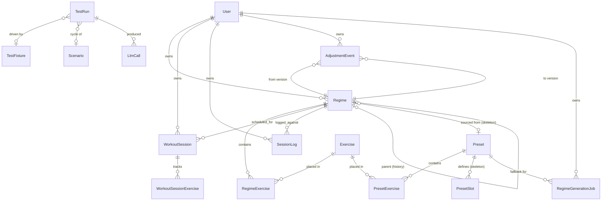

# Rebound.ai — Data Model

*Authoritative, implementation-accurate schema — kept in sync with `packages/db/prisma/schema.prisma`, not a product-level draft. For why these objects exist, see [`PRD.md`](./PRD.md)'s Data Model section. For how they're accessed (RLS, connection tiers), see [`TDD.md`](./TDD.md).*

**When this drifts from `schema.prisma`, the schema wins.** Re-generate this document's entity list against the schema file rather than trusting it blindly after any migration.

## Entity-relationship overview

## User

Identity, goal, and safety-tier state. Clerk's user id is the primary key directly — no separate identity-mapping table.

| Field | Type | Notes |
| --- | --- | --- |
| `id` | String (PK) | Clerk user id |
| `createdAt` | DateTime | |
| `goalType` | enum `GoalType` | `INJURY_RECOVERY` \| `STRENGTH` \| `MOBILITY` \| `GENERAL_FITNESS` |
| `riskTier` | enum `RiskTier` | `GENERAL` \| `LIGHT_INJURY` \| `HEAVIER_CHRONIC_ELDERLY` — set at onboarding, drives the change-ceiling table, **never reassessed post-onboarding** (known gap, see `TDD.md`) |
| `conditionFlags` | String[] | e.g. autoimmune, post_surgical, chronic |
| `targetMovements` | String[] | Array for forward compatibility; v1 enforces a single primary movement at the UI/API layer |
| `role` | enum `UserRole` | `USER` \| `ADMIN` |
| `signupCohort` | enum `SignupCohort` | `BETA` \| `PROD` |
| `wakeTimeMinutes` | Int? | Minutes since local midnight; regime activation falls back to 7am if unset |
| `eveningTimeMinutes` | Int? | Same pattern, falls back to 6pm if unset |
| `availableEquipment` | Equipment[] | Empty = bodyweight-only; `BODY_ONLY`/no-equipment exercises always eligible regardless |
| `manualHold` | Boolean | Admin-set; checked by both the escalation monitor and Flow B before either acts |
| `manualHoldReason` | String? | |

## Exercise (library item)

873 rows seeded from Free Exercise DB (public domain, text-only — no PT annotation in v1).

| Field | Type | Notes |
| --- | --- | --- |
| `id` | String (PK, cuid) | |
| `name` | String | |
| `category` | enum `ExerciseCategory` | `MOBILITY` \| `STRENGTH` \| `STRETCH` |
| `targetMuscleGroups` | String[] | |
| `difficultyLevel` | Int | |
| `equipment` | enum `Equipment`? | Null = source recorded none (distinct from `BODY_ONLY`, an explicit "no equipment needed") |
| `contraindications` | String[] | Empty for every row today — no PT-annotated content yet |
| `progressionGroup` | String? | Links easier/harder variants of the same movement |
| `media` | Json? | Instructional image/video refs |
| `source` | String | |
| `externalId` | String? (unique) | Free Exercise DB slug, for idempotent re-seeding |

`Equipment` enum: `BODY_ONLY`, `MACHINE`, `OTHER`, `FOAM_ROLL`, `KETTLEBELLS`, `DUMBBELL`, `CABLE`, `BARBELL`, `BANDS`, `MEDICINE_BALL`, `EXERCISE_BALL`, `EZ_CURL_BAR`.

## Regime (versioned — the object the agent modifies over time)

| Field | Type | Notes |
| --- | --- | --- |
| `id` | String (PK) | |
| `userId` | String (FK → User) | |
| `versionNumber` | Int | Unique per `(userId, versionNumber)` |
| `createdAt` | DateTime | |
| `createdBy` | enum `RegimeCreatedBy` | `AGENT` \| `USER_EDITED` \| `PRESET_FALLBACK` |
| `status` | enum `RegimeStatus` | `DRAFT` \| `ACTIVE` \| `SUPERSEDED` \| `ENDED` |
| `endReason` | String? | |
| `sourcePresetId` | String? (FK → Preset) | Set when built from a skeleton `Preset` — lets the review UI show the protocol shape/citation that backed this regime. Null for freeform, `USER_EDITED`, or `PRESET_FALLBACK` regimes |
| `parentRegimeId` | String? (self-FK) | Links each version to the one it replaced — supports history/rollback |

`exerciseList: RegimeExercise[]` — one row per exercise placed in the regime, carrying:

| Field | Type | Notes |
| --- | --- | --- |
| `sets`, `reps`, `durationSeconds`, `frequency` | optional | Prescription |
| `sessionSlot` | enum `SessionSlot` | `MORNING` \| `EVENING` |
| `orderIndex` | Int | |

## Presets

Independent of a user's personalized regime; also the fallback destination when Flow A fails to produce a valid regime, and (as of the skeleton-retrieval addition) the *primary* grounding for a fresh Flow A draft when a matching skeleton exists.

| Field | Type | Notes |
| --- | --- | --- |
| `id` | String (PK) | |
| `name`, `description` | | |
| `riskTier` | enum `RiskTier`? | |
| `kind` | enum `PresetKind` | `FALLBACK` (concrete regime, `assignFallbackPreset`'s zero-LLM path) \| `SKELETON` (a slotted protocol shape Flow A retrieves and fills, has `PresetSlot` rows instead of `PresetExercise` rows) |
| `goalType` | enum `GoalType`? | Skeleton retrieval key |
| `bodyRegionTags` | String[] | Keyword-matched against free-text `targetMovement`/`symptomsText` — not a structured FK, since target movement is unconstrained free text |

`exerciseList: PresetExercise[]` — same shape as `RegimeExercise`, for `FALLBACK`-kind presets.

`slots: PresetSlot[]` — for `SKELETON`-kind presets:

| Field | Type | Notes |
| --- | --- | --- |
| `sessionSlot`, `orderIndex` | | |
| `label` | String | Human-readable intent shown to the LLM alongside the narrowed candidate exercises, e.g. "Primary shoulder mobility drill" |
| `exerciseCategory`, `muscleGroupTags`, `maxDifficulty` | optional | Constraints `search_exercises` is scoped to when filling this slot |
| `suggestedSets`, `suggestedReps`, `suggestedDurationSeconds`, `suggestedFrequency` | optional | The LLM personalizes within these, doesn't invent from scratch |
| `rationale` | String? | Literature grounding for why this slot exists — audit trail back to a named source |

## Workout Session

One per scheduled morning/evening slot, per day. Distinct from Session Log: this tracks exercise *completion* (what streaks are computed from); Session Log tracks self-reported *stats*.

| Field | Type | Notes |
| --- | --- | --- |
| `id` | String (PK) | |
| `userId` | String (FK → User) | |
| `regimeVersionId` | String (FK → Regime) | Included in the unique constraint deliberately — a same-day regime change (restart, escalation rollback) must not collide with the previous regime's rows for that day |
| `date` | Date | |
| `slot` | enum `SessionSlot` | `MORNING` \| `EVENING` |
| `scheduledAt` | DateTime | |
| `completedAt` | DateTime? | |
| `durationSeconds` | Int? | Elapsed time of a guided session (`/session/[slot]`), client-timed; null for the quick "mark complete" path |

Unique on `(userId, regimeVersionId, date, slot)`.

`exercisesCompleted: WorkoutSessionExercise[]` — `{ exerciseId, completed: Boolean }` per exercise.

**Known gap**: rows are only ever created for "today," once, at `regime.activate` — no daily job pre-creates future days' rows.

## Session Log

One per day — the daily stat/pain check-in, bundled with the morning session.

| Field | Type | Notes |
| --- | --- | --- |
| `id` | String (PK) | |
| `userId` | String (FK → User) | |
| `regimeVersionId` | String (FK → Regime) | |
| `loggedAt` | DateTime | Unique per `(userId, loggedAt)` — combined with an explicit once-daily guard in the handler, since a raw timestamp rarely collides on its own |
| `painScore` | Int | 0–10 |
| `mobilityStrengthIndicator` | Json? | Flexible/typed per `goalType` |
| `completed` | Boolean | |
| `perceivedExertion` | Int? | |
| `flag` | Boolean | "This made it worse" — feeds the adverse-event guardrail metric and the escalation monitor |

## Adjustment Event

Audit trail for the agent; also backs the reversal-rate guardrail metric.

| Field | Type | Notes |
| --- | --- | --- |
| `id` | String (PK) | |
| `userId` | String (FK → User) | |
| `fromRegimeVersionId`, `toRegimeVersionId` | String (FK → Regime, both) | |
| `triggeredAt` | DateTime | |
| `triggerType` | enum `TriggerType` | `SCHEDULED_ADJUSTMENT` \| `ESCALATION_ROLLBACK` |
| `trailingWindowUsed` | Int | Days of Session Log history used — confirms only 1–2 weeks used |
| `rationale` | String | Agent's stated reason, stored even if not user-facing; also carries system-level causes (e.g. "held due to API outage") |
| `wasReversed` | Boolean | Set retroactively — the reversal-rate guardrail metric as a first-class field. An event counts as reversed once a later rollback lands the active regime back at its *starting* version or earlier |

## Regime Generation Job

Backs Flow A's async-job + polling architecture.

| Field | Type | Notes |
| --- | --- | --- |
| `id` | String (PK) | |
| `userId` | String (FK → User) | |
| `status` | enum `JobStatus` | `PENDING` \| `COMPLETE` \| `FAILED` |
| `retryCount` | Int | |
| `createdAt`, `completedAt` | DateTime | |
| `resultRegimeId` | String? (FK → Regime) | |
| `fallbackPresetId` | String? (FK → Preset) | Set when retries exhausted and a `FALLBACK`-kind preset was cloned in |
| `error` | String? | **Never returned to the client** — the API's `getJobStatus` selects an explicit safe field set only (see `TDD.md`'s security notes) |

## Admin experimentation dashboard tables

Not user-owned data — RLS enabled with zero policies (default-deny for the restricted role); only the privileged/unscoped connection touches these. See `TDD.md`'s RLS section for why "not user-owned" still requires RLS *enabled*, just policy-free.

**LlmCall** — one row per actual Anthropic/Gemini API call (each tool-use round-trip is its own row): `flow` (enum `LlmFlow`: `FLOW_A_DRAFT` \| `FLOW_B_ADJUST` \| `FREE_TEXT_CLASSIFIER`), `source` (`PRODUCTION` \| `ADMIN_TEST`), `model`, `groupId`/`sequenceIndex` (correlates every call in one flow invocation), `userId?`, `testRunId?`, `inputTokens`/`outputTokens`/`latencyMs`/`costUsd`, `stopReason`, `success`, `errorMessage?`, full `requestJson`/`responseJson`.

**TestFixture** — a saved synthetic input for dry-running a flow, never references a real `User` row: `type` (`ONBOARDING` \| `ADJUSTMENT`), `payload` (Json matching the corresponding schema).

**TestRun** — one admin-triggered dry run OR one cycle within a `Scenario` chain. Never writes to `User`/`Regime`/`AdjustmentEvent` — the isolation guarantee. `fixtureId?` (null for a scenario cycle beyond cycle 0), `flow`, `model`, `status` (`RUNNING` \| `VALID` \| `INVALID` \| `ERROR`), `resultJson?`, `scenarioId?`/`cycleIndex?`/`inputJson?` (cycle-chain fields), `createdByUserId`.

**Scenario** — a synthetic Flow A → Flow B → Flow B... chain: `name`, `description?`, `createdByUserId`. Cascades: deleting a `Scenario` deletes every `TestRun` in it and every `LlmCall` on those runs.

## Rate limiting

**RateLimit** — fixed-window counters, keyed `"<scope>:<identity>"`: `key` (PK), `count`, `expiresAt`. Not user-owned (rows exist for unauthenticated IPs too); RLS-enabled with zero policies, same treatment as the admin tables — the limiter runs on the privileged client before `withAuth`'s RLS transaction opens.

## Enums reference

| Enum | Values |
| --- | --- |
| `GoalType` | `INJURY_RECOVERY`, `STRENGTH`, `MOBILITY`, `GENERAL_FITNESS` |
| `RiskTier` | `GENERAL`, `LIGHT_INJURY`, `HEAVIER_CHRONIC_ELDERLY` |
| `UserRole` | `USER`, `ADMIN` |
| `SignupCohort` | `BETA`, `PROD` |
| `ExerciseCategory` | `MOBILITY`, `STRENGTH`, `STRETCH` |
| `SessionSlot` | `MORNING`, `EVENING` |
| `RegimeCreatedBy` | `AGENT`, `USER_EDITED`, `PRESET_FALLBACK` |
| `Equipment` | `BODY_ONLY`, `MACHINE`, `OTHER`, `FOAM_ROLL`, `KETTLEBELLS`, `DUMBBELL`, `CABLE`, `BARBELL`, `BANDS`, `MEDICINE_BALL`, `EXERCISE_BALL`, `EZ_CURL_BAR` |
| `PresetKind` | `FALLBACK`, `SKELETON` |
| `RegimeStatus` | `DRAFT`, `ACTIVE`, `SUPERSEDED`, `ENDED` |
| `TriggerType` | `SCHEDULED_ADJUSTMENT`, `ESCALATION_ROLLBACK` |
| `JobStatus` | `PENDING`, `COMPLETE`, `FAILED` |
| `LlmFlow` | `FLOW_A_DRAFT`, `FLOW_B_ADJUST`, `FREE_TEXT_CLASSIFIER` |
| `LlmCallSource` | `PRODUCTION`, `ADMIN_TEST` |
| `TestFixtureType` | `ONBOARDING`, `ADJUSTMENT` |
| `TestRunStatus` | `RUNNING`, `VALID`, `INVALID`, `ERROR` |
| `SyntheticPainPattern` | `IMPROVING`, `PLATEAUING`, `WORSENING`, `CONTRADICTORY` |

## Constraints worth knowing before changing this schema

- `RegimeGenerationJob.userId` is a required FK — the `User` row must exist before the job row is created (why `upsertUserForOnboarding` runs synchronously before job creation, not inside the backgrounded draft step).
- Delete order matters for any script that resets fixture data: `AdjustmentEvent` and `SessionLog` before `Regime` (neither cascades from `Regime`; only `RegimeExercise`/`WorkoutSessionExercise` cascade from their parents).
- Prisma's `update`/`create` treat an explicit `undefined` field as "don't touch this," not "set to null" — relied on deliberately in onboarding upserts so a re-submission that omits a field (e.g. declined a prompt) doesn't wipe a previously-saved value.
- Every new table added to this schema needs an explicit RLS decision recorded in `packages/db/sql/rls-policies.sql` or CI's `pnpm check:rls` fails the build — this is enforced, not a reminder.
