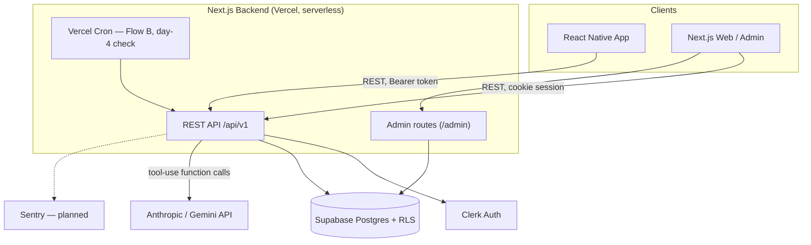

# Rebound.ai — Technical Design Document

*How Rebound.ai is built. For what/why, see [`PRD.md`](./PRD.md). For the schema, see [`DATA_MODEL.md`](./DATA_MODEL.md). For build status and what's next, see [`ENG_PLAN.md`](./ENG_PLAN.md).*

**Status as of this writing**: live beta on Vercel, real Supabase + Clerk + Anthropic/Gemini, no paying users yet, REST API (migrated off tRPC), Postgres RLS enforced and CI-checked. `pnpm typecheck`/`pnpm test`/`pnpm check:rls` are the ground truth for "is this actually working" — re-run them before trusting any status claim in a document, including this one.

## Decisions made (recap)

| Decision | Choice | Why |
| --- | --- | --- |
| Beta scope | Full Flow A + Flow B, real accounts, no paywall enforcement | Beta is for surfacing product/logic weaknesses, not monetization |
| Background jobs (v1) | Vercel Cron + serverless functions, no external queue | Escalation monitor and Flow B's user volume are both small enough at beta scale to run inline/in-cron without dedicated job infra |
| Escalation monitor | Runs inline, synchronously, inside the Session Log write endpoint | It's a threshold check against one row of data — no reason to queue it |
| Onboarding regime generation | Async job + client polling | LLM draft + validation can take several seconds; blocking the UI on that is a bad first impression for a habit-loop app |
| API layer | REST, OpenAPI-contracted (migrated off tRPC) | Any client language, standard tooling, no monorepo-TypeScript coupling requirement — see "API layer" below |
| ORM | Prisma | Best-documented option for a first build; RLS-via-Clerk-JWT is a well-trodden path with Prisma + Supabase |
| Environments | Vercel preview deploys double as staging; one beta environment tracks toward production | No separate staging infra to build or pay for at this stage |
| Admin tooling | Internal admin view + LLM experimentation dashboard + scenario simulator | No clinician in the loop yet — need visibility into flagged users, a manual override, and a way to iterate on Flow A/B quality without waiting on real user data |
| Rate limiting | Postgres-backed, all `/api/v1` routes | LLM-generation routes had no spend guard beyond auth; Postgres avoided standing up Redis before it was load-bearing, with a documented swap point |
| LLM provider | Multi-provider (Anthropic + Gemini), Gemini the current cost-conscious production default | See "LLM provider & model choice" below |
| Beta data | Separate Supabase project — fresh database at real launch | Beta data will have inconsistencies baked in; a clean cutover keeps Success Metrics trustworthy |

## Repo layout

```
apps/web        Next.js 16, Clerk auth, REST route handlers (/api/v1), cron routes, admin UI
apps/mobile     Expo Router, Clerk mobile auth, generated REST client — full screen set mirroring apps/web
packages/db     Prisma schema (real Supabase Postgres), exercise-library + preset seed scripts
packages/api    Framework-agnostic handler functions (business logic) — the real backend API surface
packages/contracts   Zod request/response schemas + generated OpenAPI spec — the source of truth both
                     apps' typed REST clients are generated from
packages/clinical-rules   Pure deterministic safety logic, zero DB/LLM deps, unit tested
packages/agents Anthropic/Gemini SDK orchestration — Flow A, Flow B, classifiers, job runner, admin dry-run engine
```

`packages/api`'s handler functions take a plain `{ prisma, userId }` context and are framework-agnostic; `apps/web/src/app/api/v1/**/route.ts` files are thin wrappers around them. Zero tRPC, `@trpc/*`, or `superjson` anywhere in the codebase — don't reintroduce them without a real reason (see "API layer" below for why they were removed).

## System architecture



## API layer: REST, OpenAPI-contracted

**Why REST instead of tRPC.** The project started on tRPC and migrated to REST once it was clear there'd be no external API consumers yet and it was the easiest point to migrate. Rationale: portability/longevity (any client language, standard tooling) over tRPC's TypeScript-monorepo coupling — not a claim that tRPC was broken.

**Architecture:**
- `packages/contracts` — Zod schemas per domain, `@asteasolutions/zod-to-openapi` generates a committed `openapi.json`. Zero DB/LLM dependencies deliberately (`packages/agents` builds its LLM clients eagerly at module load, which would otherwise leak into anything importing schemas from `packages/api`).
- `packages/api/src/handlers/**` — one file per domain (`onboarding.ts`, `regime.ts`, `session-log.ts`, `workout-session.ts`, `user.ts`, `exercise.ts`, `progress.ts`, `adjustment-event.ts`, `admin.ts`, `admin-experiments.ts`, `health.ts`), plain exported async functions taking `(ctx: { prisma, userId }, input)`.
- `apps/web/src/lib/rest/with-auth.ts` — `withAuth` / `withAdminAuth` / `withAdminOnlyAuth`. `withAuth` resolves Clerk's `auth()` *before* touching the request body, then opens a `prismaRls.$transaction` and sets `app.user_id` via parameterized `set_config()` — every downstream query in that request runs through the RLS-scoped transaction client. `withAdminOnlyAuth` deliberately skips the transaction and uses a narrowed privileged client instead (`prismaUnscoped`, see "Database access & RLS" below) — a real admin-triggered Flow A/B call routinely exceeds Prisma's 5s interactive-transaction timeout.
- `apps/web/src/app/api/v1/**/route.ts` — thin Route Handlers, proper REST verbs/nouns (e.g. `POST /regimes/:id/activate`, not an RPC-name-shaped URL). Composed as `withCors(withRateLimit(RATE_LIMITS.x)(withAuth(handler)))`.
- Both apps consume a typed `openapi-fetch` client generated from `openapi.json` (`schema.d.ts`, regenerated via `pnpm generate`). `apps/mobile` has a dedicated `ApiProvider` injecting a Bearer token from Clerk's `getToken()`, since it has no cookie to ride on the way web does.
- `unwrap()` (`api-error.ts`, both apps) turns `openapi-fetch`'s `{data, error}` result into a thrown `ApiClientError`.

**Current route inventory** (`apps/web/src/app/api/v1/`):

```
GET    /health
GET    /exercises/:exerciseId
GET    /users/me                      PATCH implied by handler set — see user.ts
GET    /users/me/notification-times   PUT
POST   /users/me/cancellation-feedback
POST   /onboarding
GET    /onboarding/jobs/:jobId
GET    /regimes/:regimeId
POST   /regimes/:regimeId/activate
POST   /regimes/restart
POST   /session-logs
GET    /workout-sessions/today
POST   /workout-sessions/:id/complete
GET    /progress/summary
GET    /progress/streak-calendar
GET    /progress/milestones
GET    /adjustment-events
GET    /admin/flagged-users
GET    /admin/metrics
POST   /admin/users/:userId/manual-hold
GET,POST /admin/experiments/fixtures            (+ /:id)
GET    /admin/experiments/models
GET    /admin/experiments/llm-calls
GET,POST /admin/experiments/test-runs           (+ /:id)
GET,POST /admin/experiments/scenarios           (+ /:id, + /:id/next-cycle)
```

Cron routes live outside `/api/v1` (`/api/cron/flow-b`, `/api/cron/day-4-check`), gated by `CRON_SECRET`, not user auth.

## Database access & RLS

**Two-tier trust model:**

- **Privileged connection (`DATABASE_URL`)** — owns the tables, Postgres RLS never applies to it. Used by `packages/agents` and `/api/cron/*`, which have no single "current user" to scope to (Flow B iterates many users per run).
- **Restricted connection (`DATABASE_URL_RLS`, `rebound_app` role)** — subject to RLS, used only inside `withAuth`'s transaction. `prismaUnscoped` further narrows the privileged client for `withAdminOnlyAuth`'s use case: typed (`Pick<PrismaClient, ...9 non-user-owned models>`) *and* runtime-Proxy-enforced (throws on any other model or on `$queryRaw`/`$executeRaw`/`$transaction`) — reaching for a user-owned table from an admin-only route fails to compile, not just "shouldn't happen."

**Coverage is CI-enforced, not just convention.** `pnpm check:rls` parses every `model` block in `schema.prisma` against every `ALTER TABLE ... ENABLE ROW LEVEL SECURITY` in `packages/db/sql/rls-policies.sql` and fails the build by table name if one is missing — added after a real regression (`preset_slots` silently had no RLS decision recorded for a period). A real cross-user isolation test (`packages/db/src/__tests__/rls-isolation.test.ts`, two real accounts through the restricted role) runs against the live database, not just against the policy file: unfiltered reads, fetch-by-known-id, update/delete of another user's row, a forged insert claiming another user's id, relation joins, `app.is_admin` cross-user visibility, and the shared/no-RLS tables all covered.

**Policy shape**: one row-ownership policy per user-owned table (`users`, `regimes`, `workout_sessions`, `session_logs`, `adjustment_events`, `regime_generation_jobs`, `regime_exercises`/`workout_session_exercises` via an `EXISTS` subquery against their parent). Shared-library tables (`exercises`, `presets`, `preset_exercises`, `preset_slots`) get RLS **enabled** with a permissive `SELECT`-only policy — enabling RLS at all matters independently of ownership-based filtering, because Supabase's auto-generated PostgREST API exposes any public-schema table with RLS disabled regardless of whether this app's own code ever queries it that way. Admin-only/system tables (`llm_calls`, `test_fixtures`, `test_runs`, `scenarios`, `rate_limits`) get RLS enabled with **zero** policies — full default-deny for `rebound_app`, since only the privileged/unscoped connection ever touches them.

## Rate limiting

Postgres-backed (`packages/api/src/rate-limit.ts`), not Redis: a single `INSERT ... ON CONFLICT DO UPDATE ... RETURNING` per check against the `RateLimit` model, atomic under concurrent serverless invocations. Chosen over standing up Upstash immediately because the protected routes (LLM generation) are already several seconds of model time — one extra DB round trip is noise — and it's zero new infrastructure at beta scale. `consume()`'s signature is shaped like `@upstash/ratelimit`'s return value, so swapping the backend later is a one-file change.

Policy: onboarding 5/hr, admin-triggered LLM work 30/hr, ordinary mutations 60/min, reads 300/min, unauthenticated/anonymous 20/min (IP-keyed). Applied to every `/api/v1` route via `withRateLimit()`, composed outside `withAuth` since the limiter writes via the privileged client before any RLS transaction opens. **Fails open** on a DB error — advisory, not the last line of defense (RLS is). Known operational ceiling: Supabase's connection pooler caps at 15 clients in session mode; under real connection exhaustion the limiter currently lets traffic through rather than shedding it.

## Security headers & CSP

Request-invariant headers (`X-Frame-Options`, `X-Content-Type-Options`, `Referrer-Policy`, `Permissions-Policy`, HSTS) live in `next.config.ts`'s `headers()`. CSP is per-request, generated in `apps/web/src/proxy.ts` (Next 16's `middleware.ts`) with a fresh nonce per request via Web Crypto, threaded through as both the response header and an `x-nonce` request header that `app/layout.tsx` reads to stamp inline scripts (`<ClerkProvider nonce={nonce}>`, the large-text init script). `unsafe-eval` is dev-only (React Refresh needs it, production doesn't). `unsafe-inline` stays as a CSP2-only fallback in `script-src` and unconditionally in `style-src` (the app styles largely via inline `style={{...}}` props, which nonces can't cover). Deliberately **no** `strict-dynamic` — Clerk's own script loads without a nonce, so `strict-dynamic` would block sign-in under a CSP3 browser; the host allowlist + nonce do the job instead. **Known gap**: the allowlist only covers Clerk's Development instance domain — needs the Production frontend API domain added at Clerk cutover time, or sign-in breaks under the nonce policy in prod.

## Clinical safety logic (`packages/clinical-rules`)

Pure functions, zero I/O, fully unit tested:
- `checkRedFlags` — structured red-flag screen
- `determineRiskTier` — **provisional policy**, not clinically signed off (see "Known gaps" below)
- `validateStructure` (schema) + `validateRegime` (absolute bounds + change-ceiling delta check)
- `checkEscalation` — the real-time pain-spike threshold table

These are deliberately framework-agnostic and DB-free so they can be unit-tested deterministically and reviewed by a PT/clinical advisor in isolation from the LLM's judgment — see PRD's Pre-launch validation.

## LLM orchestration (`packages/agents`)

**Flow A — initial regime generation**, current implementation (more concrete than the PRD's architecture prose):

1. Red-flag screen + free-text classifier pass (rules + cheap classifier model).
2. Risk tiering (rules-based).
3. **Skeleton-preset retrieval** (`skeleton-retrieval.ts`) — a structured filter (no embeddings) narrows candidate `Preset` rows of `kind: SKELETON` by `goalType` × `riskTier`, then keyword-matches `bodyRegionTags` against the user's free-text target movement/symptoms. Falls back to a `general`-tagged skeleton if no region match, or `null` if none exists for that goal/tier combination. This is a real architecture addition beyond a pure freeform LLM draft — grounds the LLM in a hand-authored, literature-cited protocol shape (`PresetSlot` rows carry a `rationale` field back to a named source) rather than free invention.
4. **LLM fills the skeleton's slots** (`submit-skeleton-regime` tool) when one was found, or drafts freeform via `submit_regime`/`search_exercises` tools when not — selecting exercises by ID, never free text, and assigning morning/evening slots.
5. Structural validation → `validateRegime` (absolute bounds only, no `previousRegime` yet).
6. Retry loop with backoff (`regime-generation-job.ts`) on failure; exhaustion falls back to `assignFallbackPreset` (`preset-fallback.ts`, `kind: FALLBACK` presets, matched by risk tier, re-validated before persisting).

**Flow B — recursive adjustment** (`flow-b.ts`, `flow-b-runner.ts`): trailing Session Log window pulled, LLM proposes hold/progress/rollback + re-slotting via `submit_adjustment`, `validateRegime` **with** delta check, one retry with the rejection reason fed back as context, persists new regime version + `AdjustmentEvent`.

**Escalation monitor**: inline inside the Session Log write handler, rules-only, never calls an LLM — `applyEscalationRollback` (`escalation-actions.ts`) flips regime status and logs the event; shared between the real-time monitor and the day-4 post-rollback check.

**Reliability mechanics carried by both flows**: a shared self-correction budget inside the tool-use loop (invalid exercise ID, or a malformed tool call shape like a non-array `exercises` field — both feed an error back into the same turn instead of crashing), `max_tokens: 4096` (a full 10–12 exercise regime plus reasoning routinely needs more than a smaller default), and full LLM call logging (below) for every real call, production included.

## LLM provider & model choice

**Multi-provider, not Anthropic-only.** `packages/agents/src/gemini-adapter.ts` normalizes Gemini's API to the same tool-use call shape the rest of the code expects from Anthropic's SDK, so `flow-a.ts`/`flow-b.ts`/the classifier don't need provider-specific branches beyond model selection. `packages/agents/src/models.ts` is the single source of truth for which models the admin dashboard can pick from and their per-token pricing (used for `LlmCall.costUsd`).

**Current production default: `gemini-3.6-flash`** (`packages/agents/src/client.ts`, `REGIME_MODEL`), a cost-conscious swap from the PRD's original Sonnet-5-for-both-flows decision. Claude models (Sonnet 5, Opus 5, Haiku 4.5) remain fully callable via `FlowCallOptions.model` or the admin test-run picker — reserved for more complex tasks or side-by-side comparison, not the default for real traffic. **This deviation from the PRD is real and current, not a stale note** — see `ENG_PLAN.md` for the gap this surfaced in project record-keeping. Re-confirm this is still the intended production default before treating it as settled; it hasn't gone through the same explicit "resolved" write-up the original Sonnet-5 decision got.

**LLM call logging**: every real Anthropic/Gemini call, production and admin-test alike, is wrapped by `loggedMessagesCreate()` (`llm-call-logger.ts`) and written to `LlmCall` (model, tokens, latency, cost, full request/response JSON, tagged `source: PRODUCTION | ADMIN_TEST`). This is the app's only LLM observability today — no external tool (e.g. Langfuse/Helicone) is wired in; `LlmCall` rows are queried directly for cost/latency/failure-rate analysis (see the admin dashboard below and the PRD's Unit Economics open item, which this table is meant to eventually answer with real data instead of an estimate).

## Admin & experimentation tooling

- **`/admin`** — flagged users (escalation rollbacks, "made it worse" flags, failed jobs), manual-hold toggle, basic metrics (activation funnel, adverse events, Flow A/B failure counts, reversal rate). Gated by `withAdminAuth`'s DB-backed role check, layered with `proxy.ts`'s route-level default-protect.
- **`/admin/experiments`** — manually trigger Flow A or Flow B against a saved fixture with any available model, inspect the full trace (tool calls, tokens, latency, cost). Runs never write `User`/`Regime`/`AdjustmentEvent` rows — verified isolation, not just intent.
- **`/admin/experiments/scenarios`** — chains a real Flow A dry run into one or more synthetic Flow B cycles (`synthetic-session-logs.ts` generates IMPROVING/PLATEAUING/WORSENING/CONTRADICTORY pain curves), so a regime's evolution can be watched over several simulated weeks without waiting on real user data. `regime-diff.ts` diffs consecutive cycles. This is the concrete tool behind the PRD's "held-out test set of realistic trajectories" pre-launch validation requirement, and the intended entry point for the still-open Flow A/B quality work (see `ENG_PLAN.md`).

Both dashboards use `withAdminOnlyAuth`/`prismaUnscoped` (see "Database access & RLS" above) since they read/write only the non-user-owned experimentation tables.

## Non-functional concerns

**Performance**: no caching layer yet (exercise library, preset regimes could benefit — flagged as an Upstash Redis follow-on once request volume makes it matter). No connection pooling beyond Supabase's own pgbouncer; a known ceiling (15 clients in session mode) has already surfaced once under a load test, see Rate limiting above.

**Scalability**: Vercel Cron + inline handling is explicitly a beta-scale choice — Flow B's due-user query iterates every due user serially in one cron invocation, with no per-job observability or retry isolation beyond the flow-level retry described above. `WorkoutSession` rows are only ever created for "today," once, at `regime.activate` — no daily job pre-creates future days' rows. This didn't matter for local (on-device) notifications, which recompute from live data each time the app opens, but would matter for server push notifications or any feature needing to know a future day's session time in advance.

**Security**: covered above (RLS, rate limiting, CSP) plus standard measures — Clerk-managed auth/session/password handling, server-side-only Prisma access (no Supabase client SDK, no anon key exposure), parameterized queries throughout, explicit output shaping on every handler (no full-row leakage), webhook signature verification (`svix`) on the Clerk account-deletion webhook, Dependabot for dependency scanning.

**Observability**: `LlmCall` table for LLM-specific cost/latency/failure tracking (see above); Vercel's built-in log aggregation for everything else. Sentry is named in the original tech-stack decision but **not yet wired in** — no crash reporting or error tracking exists outside logs today.

**Availability & recovery**: Supabase-managed Postgres with point-in-time recovery. No written incident/failover runbook yet.

## Environments & deployment

Vercel hosts both `apps/web` (which also hosts the shared backend) — one deploy, one language, one repo. Vercel's automatic preview deployments (one per branch/PR) function as staging at no extra setup cost; a real separate staging environment is deferred. Beta runs on its own Supabase project, deliberately disposable — a fresh production database is planned at real launch rather than migrating beta data forward wholesale (select accounts can be migrated manually if worth preserving).

**Branching model**: `feature/<name>` branches off `dev` → PR into `dev` (integration, unprotected) → PR `dev` into `main` (production, requires PR, no direct pushes). A `stage` (pre-prod) tier exists in GitHub but is deliberately out of the promotion chain for now — every `main`-bound merge so far has gone `dev` → `main` directly. GitHub Actions CI (`.github/workflows/typecheck.yml`) runs on every PR into `dev`/`stage`/`main`: monorepo typecheck, OpenAPI-artifact drift check, `pnpm check:rls`, and the test suites (unit + the live-DB RLS cross-user isolation test — this one silently *skips*, not fails, if `DATABASE_URL`/`DATABASE_URL_RLS` aren't set as repo secrets, which is a real open gap, see `ENG_PLAN.md`).

**Deployment mechanics**: `.vercel/project.json` lives at the repo root; all `vercel` CLI commands run from there, not from inside `apps/web` (running from the subpackage breaks the monorepo build — Vercel never sees the workspace root). A `.vercelignore` mirroring `.gitignore` is required — Vercel's upload step doesn't reliably respect `.gitignore` on its own. No GitHub-based auto-deploy-on-push is configured; deploys are manual `vercel --prod` from the repo root.

## Known technical gaps & tradeoffs

- **`determineRiskTier`'s thresholds and the change-ceiling `ABSOLUTE_BOUNDS`** are still invented, not clinically signed off. A literature cross-check found the "10% rule" is weaker evidence than "evidence-informed" implies (never validated in a peer-reviewed trial; a key systematic review found no injury-risk difference between 10% and 24% weekly load increases, with the real risk signal being single-session spikes rather than a weekly percentage) — this makes the current numbers more defensibly provisional, not clinically validated.
- **Flow B's due-user query** anchors to whichever `AdjustmentEvent` is most recent (any type), or regime `createdAt` if none exists — a reasonable, not spec-perfect, interpretation of "anchor to the later of the regular schedule or the most recent escalation rollback."
- **Risk tier is set once at onboarding and never reassessed** — the only lever controlling change ceilings, with no path yet for an autoimmune flare or new mid-program injury to update it.
- **No caching, no connection pooling beyond pgbouncer defaults, no Sentry** — all named as intentional beta-scale deferrals, not oversights, but worth listing here since they're the first things to revisit once real traffic exists.
- **Billing is a non-functioning preview** — `user.getMe`'s trial-status computation (whether a `SCHEDULED_ADJUSTMENT` `AdjustmentEvent` exists) is real logic matching the PRD's paywall-trigger spec, and the Flow B cron gates a user's second-and-later adjustments on `User.subscriptionActive`, but no Stripe account/keys exist yet — `subscriptionActive` is a placeholder column that never flips `true` until that's wired up, and cancellation reason codes aren't persisted to the DB either.
- **Mobile has no equivalent SVG charting library** — the web progress dashboard uses hand-rolled inline SVG; mobile's pain-trend view is a plain-flexbox bar chart instead, same data, different rendering.
- **A global swipe-gesture navigation feature was built, debugged across four native rebuilds, and reverted** — likely root cause was `react-native-gesture-handler` 2.x's synchronous native bridge method being incompatible with React Native's Bridgeless architecture (standard since 0.74+). If revisited, start with gesture-handler 3.x rather than 2.x.

For the full operational history behind these (exact commits, verification steps, session-by-session narrative), see the repo's `HANDOFF.md` — this document states current architecture, not how it got here.
