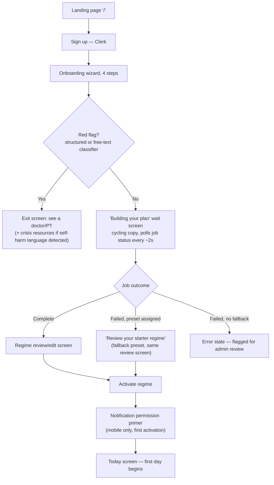
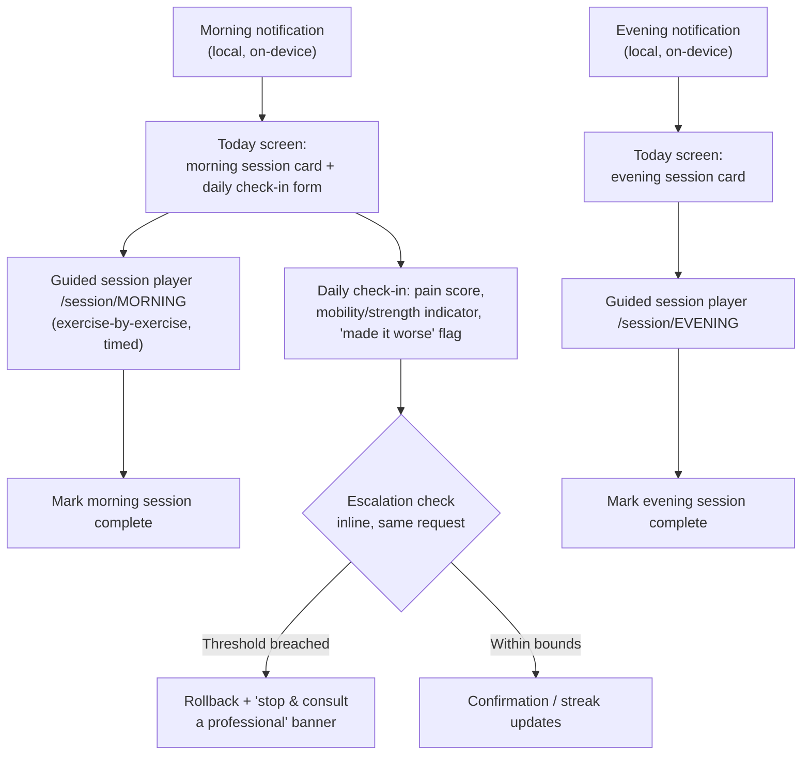
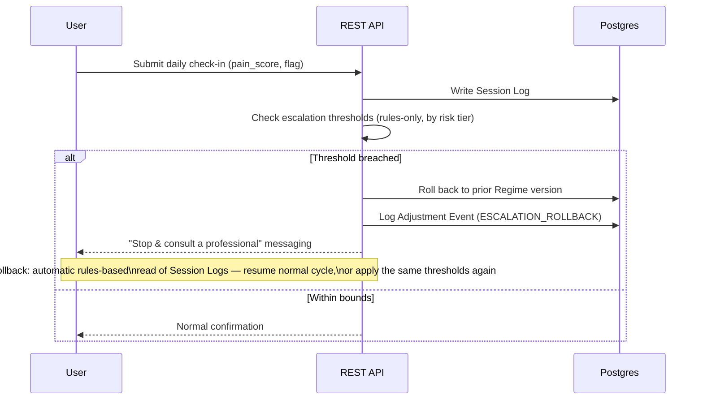
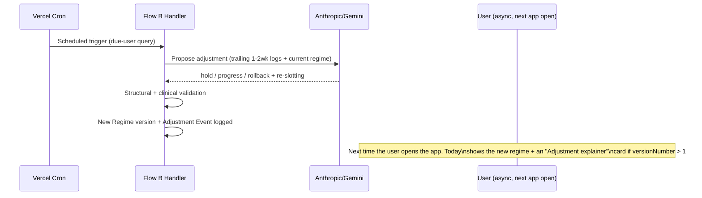
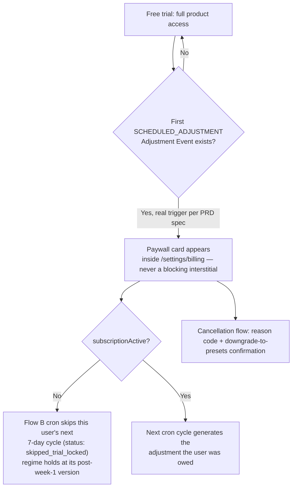

# Rebound.ai — User Flows

*The paths a user takes through the product. For the screens themselves and design tone, see [`DESIGN_BRIEF.md`](./DESIGN_BRIEF.md). For the safety logic gating these flows, see [`PRD.md`](./PRD.md)'s Clinical Risk Framing. For the technical sequence behind each step, see [`TDD.md`](./TDD.md).*

Screens are named as they exist in the repo today (`apps/web/src/app/**/page.tsx`, `apps/mobile/app/(app)/**/*.tsx`) — both apps implement the same flows over the same REST API, styled independently.

## 1. Sign-up & Onboarding

**Step detail:**
1. **Landing (`/`, web only)** — public marketing page: hero, how-it-works summary, safety blurb, pricing CTA, app-download CTA. Mobile has no equivalent — the app opens straight to sign-in/Today, since a mobile app isn't publicly browsable by URL the way a website is; the marketing job happens before install (App Store listing, the website).
2. **Sign up / sign in** — Clerk-backed, email/password + email verification (mobile: email/password only, no OAuth in v1).
3. **Onboarding wizard** — sequenced steps (reason for using the app → goal/target movement → risk/symptom questions → free-text context) rather than one long form. Captures `goalType`, `targetMovement`, condition flags, structured red-flag answers, free-text symptoms/lifestyle context, wake time, evening time, available equipment.
4. **Red-flag gate** — runs both the structured screen and a free-text classifier pass before any regime is drafted. A hit on either routes to the same exit screen, never generates a regime. Crisis-specific language (self-harm) routes to a dedicated crisis-resources screen (988, Crisis Text Line) instead of the generic "see a doctor" screen.
5. **Wait screen** — replaces a plain spinner with cycling status copy ("Reviewing your goals… / Screening for safety… / Drafting your first regime…") while the async job runs server-side (skeleton retrieval → LLM fill → structural validation → clinical validation).
6. **Regime review/edit** — exercises grouped by Morning/Evening, editable sets/reps/duration/frequency/slot per exercise, before the user ever commits to it.
7. **Activate** — re-validates server-side, creates today's `WorkoutSession` rows, starts Session Log/Workout Session tracking from this point. `versionNumber === 1` is what gates the one-time mobile notification-permission primer shown right after.

## 2. Daily Core Loop

**Step detail:**
- **Today screen** (`/today` web, `(app)/index.tsx` mobile) — both session cards (morning/evening), streak line, daily check-in form, "Adjustment explainer" card when `versionNumber > 1` linking to the matching Adjustment Event.
- **Guided session player** (`/session/[slot]`) — the newest addition to the core loop (in progress as of this writing, not yet in `HANDOFF.md`'s narrative — see `ENG_PLAN.md`): steps through the slot's exercises one at a time with client-side timing, writing `WorkoutSession.durationSeconds` on completion. A "mark complete" quick path (no player, no duration) also exists.
- **Daily check-in** is bundled with the morning session per the PRD's Daily Session Structure — one Session Log per day, `@@unique([userId, loggedAt])` plus an explicit once-daily guard.
- **Streak** — maintained by completing at least one of the day's two sessions; computed by walking backward from today (or yesterday, if today hasn't happened) counting consecutive days with ≥1 completed session.
- **Escalation check** runs inline inside the Session Log write, before the response returns — no separate step, no delay.

## 3. Escalation / Safety Rollback

The user sees this as a banner/messaging state on the Today screen after a check-in submission — not a separate screen. The thresholds themselves (single red pain log, "made it worse" flag, repeated day-over-day jumps, non-settling yellow) are documented in `PRD.md`'s Clinical Risk Framing table and are risk-tier-dependent.

## 4. Weekly Adjustment (Flow B)

This runs entirely outside a live user session — there's no "in the moment" screen for it. The user's next interaction with the Today screen surfaces the result (updated regime, explainer card, Adjustment History log entry).

## 5. Regime Restart

Reachable from `/settings/restart-regime` (both apps) — not in the original PRD text, a real feature in the current build. User picks a reason code (`GOALS_CHANGED` / `STARTING_OVER` / `OTHER`) and an optional comment, then re-runs onboarding-style regime generation from scratch rather than adjusting the current regime incrementally. Distinct from Flow B: this is user-initiated and immediate, not agent-proposed and scheduled.

## 6. Subscription / Billing (preview only — no live payments)

`user.getMe`'s trial-status computation is real logic (checks for a `SCHEDULED_ADJUSTMENT`-type event, deliberately excluding `ESCALATION_ROLLBACK` — a safety rollback isn't the product completing a normal cycle). The enforcement itself lives one level down, in the Flow B cron: it checks `User.subscriptionActive` (placeholder field, always `false` until real billing exists) before generating a user's *second* scheduled adjustment, and skips the LLM call entirely if the trial adjustment was already used and the user hasn't converted — so no inference spend goes toward a regime update a non-paying user won't see. No Stripe integration exists behind `subscriptionActive` yet — see `ENG_PLAN.md`.

## 7. Admin Flows

- **Flagged users / manual override** (`/admin`) — review users with an escalation rollback, a "made it worse" flag, or a failed generation job; toggle `manualHold` with a required reason.
- **Flow experimentation** (`/admin/experiments`) — pick a fixture + model, trigger a Flow A or Flow B dry run, inspect the full LLM call trace. Never touches real user data.
- **Scenario simulator** (`/admin/experiments/scenarios`) — chain a Flow A draft into multiple synthetic Flow B cycles against a chosen pain pattern (improving/plateaugin/worsening/contradictory), view the pain-trend chart and per-cycle regime diff. The primary tool for the Flow A/B quality work described in `ENG_PLAN.md`.

## Not-yet-built flows (proposed, no screens exist)

See `DESIGN_BRIEF.md`'s screen inventory for the full list with sourcing; the flow-relevant gaps worth naming here:
- A true multi-touch notification-permission flow (only the first touch — explain before the OS prompt — is built; the second "protect your streak" touch is not).
- Any flow around risk-tier re-assessment post-onboarding (flare-ups, new injuries) — there's no UI or backend path for this at all today.
